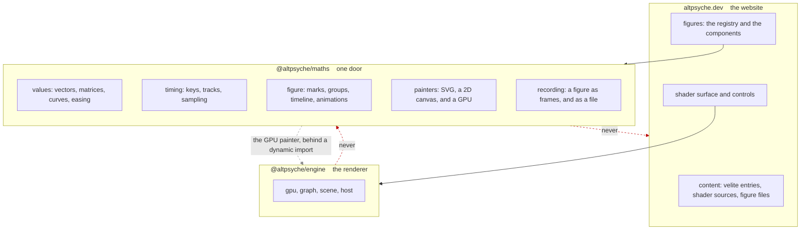

# @altpsyche/maths

This document states the design. It covers what a figure is, the rule every part of the package
follows, the line through the middle of it, and the seam everything above that line rests on. It
queues nothing. [docs/ROADMAP.md](docs/ROADMAP.md) is the only place work is queued.

It was written before the code, so the shape could be argued about while arguing was cheap. It lived
in the website that consumes the package until the package had a repository of its own. What remains
here is the package's half. The website keeps what the website owns.

## Purpose

A **figure** is a picture that moves and explains itself. A chapter can show a ray advancing toward
a surface, with the length of each step drawn beside it and a label following the ray. The same
figure records to a video file at the sizes the export dialog already offers.

The site cannot draw such a picture today. A shader draws light and prose describes it, and nothing
between the two can point at a thing on screen and name it.

The idea comes from Manim, the Python library Grant Sanderson wrote for 3Blue1Brown. Two ideas are
taken from it: a picture is a timeline of animations over named objects, and those objects are
measured in the picture's own units rather than in pixels. The rest is not taken, Python included.

Manim itself would put Python, LaTeX and ffmpeg into the build, and the build would fail on a
machine without them. Its output is a video file. A video file cannot follow the reader's light or
dark theme and cannot be scrubbed. The page does not render it, and the site's argument is that the
picture is live.

## The rule for numbers a shader owns

**A number a figure shows, that a shader also decides, comes from that shader's entry.**

A ray marcher written in TypeScript to explain a ray marcher written in GLSL is one marcher
implemented twice, in two languages, free to disagree. This site has paid for that arrangement more
than once. The canvas and the export once answered "what is this value now" in two places, and the
website's shader keyframes still show the cost.

An earlier draft forbade a figure from re-implementing shader mathematics at all, and that rule
cannot survive a series about shader mathematics. A figure explaining a circle's distance function
has to draw `length(p) - r`, and writing that in TypeScript is not a risk worth a rule.

The risk is a number. "It converges in twelve steps" is true because of a step count and an epsilon
that live in the shader. A figure holding twelve of its own is wrong the day either changes. A
formula may be re-derived; a constant may not. `check:code-parity` already holds an article's code
to the shader it documents, and this is that rule applied to a different kind of text.

**A figure never reads a shader's current state**, which is the same rule from the other side. An
overlay does not know whether the disc is edge on at this moment, because the picture underneath may
be a still.

That fixes where the work starts. **Drawing over a live shader is the first case rather than the
advanced one.** An arrow on the photon ring while the disc turns cannot contradict the shader,
because the shader is underneath it.

**A figure was flat, and that restriction was lifted at 0.10.0.** The argument for it was that a
perspective view belongs to a shader and that the engine already owns a camera and a view
projection. A figure growing its own would place two of each in the tree. The goal answers it: a
large share of the pictures this package is meant to draw are surfaces and vectors in space, so a
package refusing them refuses the goal. The camera here is a figure's camera and not the engine's,
and the two stay separate for the reason the next section gives. Every builder that works in space
returns the flat nodes the rest of the package already draws.

## Relationship to the engine

**This package depends on `@altpsyche/engine`, and the engine never depends on it.** That direction
is the rule, and a cycle is what the rule prevents.

**Why the dependency exists.** The goal is that anyone who installs this package can make the
animations, and a figures package that leaves a consumer to wire up a renderer and write shaders does
not meet it. Drawing a figure well needs a GPU: curves rendered from their control points stay exact
at any zoom, a depth buffer settles what a depth sort cannot, and neither is reachable through an SVG
element.

**What it costs a consumer who never uses it: nothing.** The GPU painter loads the engine with
`await import()`, the same way the typesetting call loads MathJax, so a consumer drawing to SVG
downloads no renderer. The engine's own backends sit behind dynamic imports too, so a browser without
WebGPU never fetches that backend.

**What it costs this package.** A fix needed from the engine ships there first. And the claim that
everything here is testable without a browser now holds for the geometry and the timing rather than
for the whole package, since what a device draws needs a device. Those gates are the painter's and
they are separate from `npm test`.

**Why the engine must never import this package.** Two imports would be a cycle, and the case that
would have caused one is a shader declaring a camera. That case does not need an import: the camera
is read from the engine and handed to a figure as data, by whatever holds both.

**The duplicate mathematics stays.** The engine publishes its own `mat3`, `mat4` and `vec3`, and this
package has its own. A duplicate type costs something only where values cross, and what crosses is
control points and matrices as numbers.

**None of this is built yet.** The GPU painter is queued in `docs/ROADMAP.md` and this section states
the arrangement it is being built to, which is a decision of Siva's rather than a description of the
tree.

One decision carries over from that draft. The engine's `Scene` is entities and a camera for the
renderer. A figure is a flat picture on a timeline. Two `Scene` types imported from two packages
into one file is a reader's problem even where it is not a compiler's, so the word here is
**figure** and never scene.

## Terminology

Six words are used throughout, each with one meaning.

A **figure** is the description of a picture over time. It has no canvas and no clock.

A **mark** is one drawn item: a filled or stroked path, or a piece of text.

A **group** holds marks and other groups under one transform.

An **animation** changes marks over a span of time.

The **timeline** is the ordered list of animations and pauses giving a figure its duration.

A **painter** turns marks into something a reader can see.

## The package graph



An arrow means "depends on".

**The website is a consumer of both and joins nothing.** It reaches the engine for every shader it
draws. It reaches maths for the figures, for the track sampling its shader controls perform by hand,
and for recording one to a file. A figure drawn on a GPU and a figure recorded are both this
package's, so the website asks for a picture rather than assembling one.

**Maths depends on the engine and on MathJax, and each is loaded by the call that needs it.** No
framework, and no browser API beyond what a painter is handed. A consumer drawing to SVG downloads
neither.

**The engine must never import maths.** One direction is a dependency and both directions are a
cycle, and the case that looked like it needed the second, a shader declaring a camera, is answered
by passing the camera as data instead.

**Neither package may import the website.** The palette, the content and the theme tokens are
arguments passed in, which is why a palette is handed to a figure rather than read from the page.

## Structure

The engine has one door and a test that keeps it that way, so this package has one door as well. It
is ESM with `sideEffects: false`, which allows a page drawing nothing to avoid paying for a painter.

A line runs through the middle of the package, named now so that a split later is mechanical.

**Below the line: values and timing.** Vectors, matrices, angles, intervals, easing curves,
interpolation and colour. Keys, tracks and sampling. This half changes almost never.

**Above the line: figures and painters.** Paths and the geometry over them, marks, groups, the
timeline, the animations, and the two painters. This half changes weekly for months.

Nothing below the line imports anything above it. Halves changing at different rates should not
share a release number, and the cut is already drawn against the day that pressure arrives.

**Timing moved out of the website and into this package.** The website already sampled a track of
keys with a flat or a straight approach, and nothing about that is shader-specific. A figure's
timeline asks the same question, so the website's keyframes read this sampler and carry none of
their own.

That move gave the package a consumer shipping before a single figure existed, which is the test of
whether a package is real or a wrapper around one idea. Every addition since has been held to it.

## The seam

```ts
marksAt(figure, seconds): readonly Mark[]
```

Evaluating a figure at a time yields a flat array of resolved marks. Transforms are applied, styles
are resolved, coordinates are in the figure's own units, and nothing has touched a screen.

The obvious alternative is `draw(context, seconds)`. It is worse for four reasons, each costing
something real.

**One picture reaches every surface.** The page paints marks into SVG, the recorder paints the same
marks into a canvas, and a test paints nothing at all. None of the three can drift from another,
since none is a second implementation.

**Manim's harder animations are the default rather than a feature.** `Transform` interpolates two
paths point by point, rebuilding the geometry every frame rather than moving it. `always_redraw`
rebuilds a shape from a changing value every frame. Both are geometry as a function of time, which
is what this signature already is. Where marks were long-lived objects under mutation, each would be
a special case.

**Text has somewhere to go.** Text marks sit in the array in order, so a text alternative is derived
from the picture rather than written twice and left to go stale.

**A painter is cheap to add.** The SVG painter and the canvas painter are the evidence: adding the
second changed nothing above it.

Four properties follow from this seam and are part of it.

**A figure is a pure function of time.** An evaluation at four seconds yields the picture at four
seconds, whatever it yielded before. Three consumers arrive at times in three different orders. The
page plays forward, a reader dragging the scrub bar jumps backward, and the recorder steps at a
fixed rate. A figure holding state between frames would answer each of them differently.

**Nothing here draws a random number.** A figure requiring one carries its own seed, so the picture
at four seconds is the picture at four seconds however many times it is requested.

**Every mark carries an identifier.** Hit testing reads the array, as everything else does. Without
identifiers it would walk the figure instead, which is two traversals of one structure.

**Marks are for explanation and not for data.** A figure of a few hundred marks redrawn sixty times
a second is comfortable. At their still times the flat demo is 181 marks and the solid one 321, each
counting the inset it draws. Reading a frame and writing its SVG at 1280 by 720 costs 3.9 and 4.2
milliseconds at the median of sixty runs, against the 16.7 a sixtieth of a second allows. Ten
thousand marks is not comfortable, and a figure wanting ten thousand wants a shader.

## Units and the frame

A figure is measured in its own units. It declares an extent, as Manim declares a frame eight units
high, and one matrix maps that extent onto whatever surface is requested.

One figure then draws at 640 pixels wide in a chapter and at 2160 by 3840 in a reel. There is no
second version of the picture. Stroke widths and font sizes are in figure units and scale with
everything else, so a line reading well in the chapter reads well in the reel.

**A figure declares what to do about aspect ratio rather than being cropped.** The export offers
three shapes, and `accretion` demonstrated what a wide composition does in a square frame: it needed
a zoom of 0.6 rather than a crop. A figure therefore supplies an extent per shape where it wants
one, and a single extent where the picture works at every shape.

**A figure may declare itself a loop.** The export offers a looping clip and a reader can select it
today. A figure ending somewhere other than where it started would give them a clip that jumps once
a second. A looping figure is one whose marks at its duration match its marks at zero. That is a
gate rather than a promise, since the two arrays are already available for comparison.

## Time

Three quantities are involved, and the site currently derives the relation between them inside the
recorder's loop:

```ts
image.data.set(await source.frameAt(time + settle / this.settings.fps, settle + frame + 1, time));
```

**Clip time** runs from zero to the duration. Keys are sampled at it, and a figure's timeline is
evaluated at it.

**Source time** is what a shader's clock receives. It leads clip time by the settling period.

**Settling** is the frames a shader draws and discards before clip time zero. A shader building its
picture from its own last frame opens on an empty one.

That arithmetic belongs to the consumer, and this package holds no clock: a figure is evaluated at a
time in clip seconds. The three quantities are one type declared once in the website, which hands
the same type to the page and to the recorder. A figure over a shader needs the same arithmetic, and
a second copy is how the two would come to disagree.

## Painters

**SVG on the page.** A figure on the page is SVG, for four reasons this site has already paid to
learn.

The screenshot sweep paints its mask over a whole canvas element, so a figure inside a canvas is a
blank rectangle to it. That blindness concealed a defect in the website through five layers of it.
SVG is in the document, so the sweep reads the picture itself.

Text in SVG is text. A screen reader reads it, a reader selects it, and the hand-written alternative
is a fallback rather than the only route.

CSS custom properties reach SVG, so a figure follows the theme toggle with nothing watching for it.

An overlay stays sharp. A figure over a shader is a transparent SVG above a canvas, composited by
the browser and crisp at any device pixel ratio. There is no second canvas to keep in step with the
shader's size.

**Canvas for recording.** The encoder takes one surface, so the recorder paints the same marks into
the 2D canvas it already builds. The recorded clip is painted rather than rasterised from the page,
which is why the two painters have to agree.

**A mark may request only what both painters implement.** SVG has filters and blend modes that a 2D
canvas either lacks or supports partially. A figure using one of them would render correctly on the
page and lose the effect silently in the export. The mark vocabulary is therefore the intersection of
the two painters rather than the union, and the type is the contract.

**A clip is inside that intersection and it is a rectangle.** SVG clips with `clip-path` and a canvas
with `clip()`, so a mark carries the rectangle it is drawn inside and both painters write it. An
arbitrary path clip is refused for a reason the rule above does not cover: a path needs a winding
number counted, which is a stencil on a card, where a box is the scissor test every device already
has. So a rectangle is what all three painters draw and a path is what two of them do.

**An inset is a second view of the same figure, magnified into a rectangle of its own frame.** It is
what the clip exists for, and it reads the marks the figure has already built rather than building
the tree again, so what it shows is the picture at that time and not a second picture that could
disagree about it. Its own view is one of the forms a timeline carries, applied in full at every time,
so nothing about an inset is a function of the clock.

**One gate paints a single mark array both ways and holds both painters to consuming every mark and
emitting the same geometry and style.** It is not a comparison of pixels. SVG text and a canvas
`fillText` do not rasterise identically, and holding them to that would be a gate failing over
antialiasing.

There is no per-figure choice between the two. A figure genuinely requiring canvas on the page would
be a change made against evidence, and no such evidence exists.

**The still frame is painted into the page before any JavaScript runs.** `marksAt` is a pure
function with no framework and no browser beneath it, so the SVG painter writes markup as a string
during the static export. A figure arrives in the HTML at its still time and begins moving when the
page hydrates. A reader with no JavaScript sees the picture, a feed reader sees the picture, and
nothing flashes empty on first paint. A canvas does none of that, and this is the strongest reason
SVG is the page painter.

## Colour

**A figure never reads the page.** It is given a palette and draws with it.

On the page the palette may be CSS custom properties, which SVG reads directly. In a recording it
may not: the recorder draws into a canvas outside the document, which no theme reaches. A figure
calling `getComputedStyle` would work on the page and fail in an export. The palette is resolved
once and handed over when the export starts.

The palette names roles rather than colours, and the names match the site's own tokens, so a figure
matches the page around it.

**A colour is parsed only out of the text it was handed.** `colourOf` reads hex and `rgb()`, which
is what permits interpolation between two colours, and rejects every other form rather than guessing
at one. A named colour parsed as black would be a wrong picture with nothing reporting the error.

## Text and equations

A text mark is text, and on the page it is a real SVG text node.

**No part of a figure's layout may depend on the width of text.** Measuring text yields an answer
depending on which fonts the machine has, so a box sized to fit a label would be a different box on
two machines. A label is placed by an anchor and an alignment, and it moves nothing else.

**An equation is paths, on the page as well as in a recording.** The draft of this document chose
KaTeX in the document for a page and MathJax in Node for a recording. That is one equation with two
pictures free to disagree, which is the case this document's opening rule exists to refuse. One
typesetter, one geometry, both surfaces.

What follows is what a reader receives instead of selectable text. A figure is one picture carrying
one label, so an equation inside it was never going to be text a character could be selected out of.
The LaTeX is that label.

**The typesetter is in this package, and the route in for its output was already here.**
`pathFromData` reads an SVG `d` attribute back as a path, which is the inverse of what the SVG
painter writes. A glyph from a typesetter, an icon from a designer and an outline exported by a
drawing program can each therefore be trimmed, aligned and interpolated into another shape. Without
it the only available shapes are the ones the builders here produce.

**The typesetter goes behind the one door rather than behind a second one**, which costs this
package its freedom from runtime dependencies. Siva's reason: nobody installs a figures package
without needing to label a picture with mathematics, so a consumer paying for MathJax and never
typesetting does not exist. It runs at build time rather than in a browser, so what a reader
downloads is unchanged.

**The door does not cost the load.** MathJax is reached by a dynamic import inside the typesetting
function, so importing the door reaches none of it and a consumer drawing figures without
typesetting pays nothing. Written as a static import instead, 41 MB of CommonJS would sit in the
graph of every consumer that draws a circle. The cost is that typesetting returns a promise.

## Reduced motion

A reader who has asked their system to reduce motion receives one still time rather than a loop, and
every figure declares which time that is. The last frame is not always the one explaining the most.

The prose has to work with the figure removed. A picture carrying a step of the argument alone is a
picture a reader can lose.

## What is measurable

- **Values and timing are pure functions**, tested without a canvas or a browser.
- **A figure at a time is an array of marks.** A gate samples named times, compares arrays, and
  names the mark that moved.
- **Comparison is by tolerance rather than by hash.** `Math.sin`, `Math.cos` and `Math.pow` are not
  specified to the last bit in JavaScript and differ between engines and versions. An exact match
  would be a gate passing on one machine and failing on another for no reason a reader could see.
- **One gate compares bytes, and it has a known boundary.** The committed pictures are held to the
  markup the demos write now, which is what makes a stale picture in the README fail loudly.
  Coordinates are written to three decimal places, so differences between engines do not reach the
  bytes. A value landing exactly on a half in the fourth place would still round two ways, and
  nothing has landed there. The fix, if anything ever does, is a picture gate comparing marks by
  tolerance. That costs the gate its ability to report a stale committed file, so it is not made in
  advance.
- **The two painters are held together** by one test painting the same array both ways.
- **A consumer's own screenshot gate can see a figure**, because SVG is in the document rather than
  inside a canvas. A gate painting a mask over a whole canvas cannot read one.
