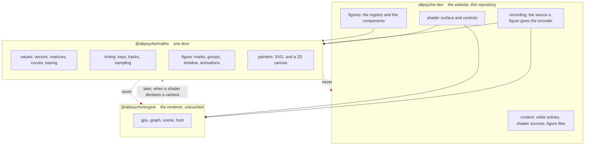

# @altpsyche/maths

The design of this package: what a figure is, the rule every part of it follows, the line through the
middle of it, and the seam everything above rests on. It queues nothing. [ROADMAP.md](ROADMAP.md) is
the only place work is queued.

It was written before the code, so the shape could be argued about while arguing was cheap, and it
lived in the website that consumes the package until the package had a repository of its own. What
is here now is the package's half of it. The website keeps what the website owns.

## What it is for

A **figure** is a picture that moves and explains itself. A chapter can show a ray walking toward a surface, with the length of each step drawn beside it and a label that follows the ray. The same figure can be recorded to a video file at the sizes the export dialog already offers.

The site cannot draw a picture like that today. A shader draws light and prose describes it, and there is nothing in between that can point at a thing on screen and name it.

The idea comes from Manim, the Python library Grant Sanderson wrote for 3Blue1Brown's videos. Two ideas are taken from it. A picture is a timeline of animations over named objects, and those objects are measured in the picture's own units rather than in pixels. The rest is not taken, including Python.

Running real Manim would put Python, LaTeX and ffmpeg into the build, and the build would fail on a machine without them. What comes out is a video file. A video file cannot follow the reader's light or dark theme, and it cannot be scrubbed. It is not something the page renders, and the site's argument is that the picture is live.

## The rule that shapes everything

**A number a figure shows, that a shader also decides, comes from that shader's entry.**

A ray marcher drawn in TypeScript to explain a ray marcher written in GLSL is the same marcher written twice, in two languages, free to disagree. This site has paid for that shape more than once. The canvas and the export once answered "what is this value now" in two places, and the website's shader keyframes carry the scar of it.

An earlier draft said a figure may never re-implement shader mathematics at all, and that rule cannot survive a series about shader mathematics. A figure explaining a circle's distance function has to draw `length(p) - r`, and writing that in TypeScript is not a risk worth a rule.

What is a risk is a number. "It converges in twelve steps" is true because of a step count and an epsilon that live in the shader. A figure that types twelve into itself is wrong the day either of them changes. So a formula may be re-derived and a constant may not. `check:code-parity` already holds an article's code to the shader it documents, and this is the same rule about a different kind of text.

**A figure also never reads a shader's current state**, which is the same rule reached from the other side. An overlay does not know whether the disc is edge on right now, because the picture underneath it might be a still.

That decides where the work starts. **Drawing over a live shader is the first case, not the advanced one.** An arrow on the photon ring while the disc turns cannot contradict the shader, because the shader is underneath it.

**A figure was flat, and that refusal is being lifted.** The argument for it was that a perspective view belongs to a shader, that the engine already owns a camera and a view projection, and that a figure growing its own would put two of each in the tree by the back door. What answers it is the goal: a large share of the pictures this package is meant to be able to draw are surfaces and vectors in space, so a package that refuses them refuses the goal. The camera that arrives here is a figure's camera and not the engine's, and the two stay separate for the reason the next section gives. The roadmap says which version it lands in.

## The engine is left alone

An earlier draft had the engine depend on this package, so that one `Vec3` existed in the tree. That was wrong, and the reason is worth keeping.

The engine publishes `mat3`, `mat4`, `vec3`, a `Scene`, a `Transform` and a draw list from its one door. A duplicate type costs something only where values cross the boundary, and nothing crosses it. A figure drawn over a shader in screen space passes no vector to the engine. The crossing appears when a shader declares a camera, which is separate work that has not been done.

Moving the engine's maths now would buy two things, and neither is worth having. A fixed release order across two repositories on the first step, and the renderer inside the blast radius of early figure work.

**So the engine is untouched.** The duplicate is real and it is free while nothing crosses.

One thing does carry over from that draft. The engine's `Scene` is entities and a camera for the renderer. A figure is a flat picture on a timeline. Two `Scene` types imported from two packages into one file is a reader's problem even when it is not a compiler's, so the word here is **figure** and never scene.

## The names

Six words are used throughout, and each means one thing.

A **figure** is the description of a picture over time. It has no canvas and no clock.

A **mark** is one drawn item: a filled or stroked path, or a piece of text.

A **group** holds marks and other groups under one transform.

An **animation** changes marks over a span of time.

The **timeline** is the ordered list of animations and pauses that gives a figure its duration.

A **painter** turns marks into something a reader can see.

## The three packages



An arrow means "depends on".

**The website depends on both packages and they do not know each other.** It reaches the engine for every shader it draws. It reaches maths for the figures, and for the track sampling its shader controls already do by hand.

**Maths depends on nothing.** No renderer, no framework, no browser API beyond what a painter is handed. That is what lets it be tested without a browser.

**Maths must never import the engine.** A painter that handed marks to the engine, so that a figure and a shader shared one surface, would look like it belongs beside the other painters. It would become a cycle the day the grey arrow above is drawn for real. That painter lives in the website, which knows both.

**Neither package may import the website.** The palette, the content and the theme tokens are arguments passed in. That is why a palette is handed to a figure rather than read from the page.

## Inside the package

The engine has one door and a test that keeps it that way, so this package has one door too. It is ESM with `sideEffects: false`, which is what lets a page that draws nothing avoid paying for a painter.

There is a line through the middle of it, and it is named now so that a split later is mechanical.

**Below the line: values and timing.** Vectors, matrices, angles, intervals, easing curves, interpolation, and the geometry a figure needs. Keys, tracks and sampling. This half changes almost never.

**Above the line: figures and painters.** Marks, groups, the timeline, the animations, and the two painters. This half changes weekly for months.

Nothing below the line imports anything above it. Things that change at different rates should not share a release number, and if that pressure ever arrives the cut is already drawn.

**Timing came out of the website and into this package.** The website already sampled a track of keys with a flat or a straight approach, and nothing about that is shader-specific. A figure's timeline asks the same question, so the website's keyframes read this sampler and carry none of their own.

That move mattered beyond tidiness. It gave the package a consumer that shipped before a single figure existed, which is the test of whether a package is real or a wrapper around one idea, and it is the test every addition since has been held to.

## The seam: a figure at a time is data

```ts
figure.at(seconds): readonly Mark[]
```

Asking a figure for a time gives back a flat list of resolved marks. Transforms are applied. Styles are resolved. Coordinates are in the figure's own units. Nothing has touched a screen.

The obvious alternative is `draw(context, seconds)`, and it is worse for four reasons that each cost something real.

**One picture reaches every surface.** The page paints marks into SVG. The recorder paints the same marks into a canvas. A test paints nothing at all. None of the three can drift from another, because none of them is a second implementation.

**Manim's harder animations are the default rather than a feature.** `Transform` interpolates two paths point by point, so the geometry is rebuilt every frame rather than moved. `always_redraw` rebuilds a shape from a changing value every frame. Both of those are geometry as a function of time, which is what this signature already is. In a design where marks were long-lived objects being mutated, each one would be a special case.

**Text has somewhere to go.** The text marks sit in the list, in order, so a text alternative comes out of the picture rather than being written twice and going stale.

**A painter is cheap to add.** The SVG painter and the canvas painter are the proof: adding the second changed nothing above it.

Four things follow from this seam and are part of it.

**A figure is a pure function of time.** Ask for four seconds and it gives the picture at four seconds, whatever it gave before. Three consumers arrive at times in three different orders. The page plays forward. A reader dragging the scrub bar jumps backward. The recorder walks a fixed step and never skips. A figure holding state between frames would answer differently for each of them.

**Randomness is seeded**, and the seed belongs to the figure rather than to the moment it is drawn.

**Every mark carries an id.** Hit testing reads the list, the way everything else does. Without ids it would have to walk the figure instead, which is two traversals of one structure.

**Marks are for explanation and not for data.** A figure of a few hundred marks redrawn sixty times a second is comfortable. Ten thousand is not, and a figure that wants ten thousand wants a shader.

## Units and the frame

A figure is measured in its own units. It declares an extent, the way Manim declares a frame eight units high, and one matrix maps that extent onto whatever surface is asked for.

One figure then draws at 640 pixels wide in a chapter and at 2160 by 3840 in a reel. There is no second version of the picture. Stroke widths and font sizes are in figure units too and multiply up with everything else, so a line that reads well in the chapter reads well in the reel.

**A figure declares what to do about shape, rather than being cropped.** The export offers three shapes, and `accretion` already showed what a wide composition does in a square frame. It needed a zoom of 0.6 rather than a crop. So a figure gives an extent per shape where it wants one, and a single extent where the picture works everywhere.

**A figure may declare itself a loop.** The export already offers a seamless loop, and a reader can tick it today. A figure that ends somewhere other than where it started would give them a clip that jumps once a second. A looping figure is one whose marks at its duration match its marks at zero. That is a gate rather than a promise, because the two lists are already there to compare.

## Time

Three numbers are involved, and the site currently works out the relation between them inside the recorder's loop:

```ts
image.data.set(await source.frameAt(time + settle / this.settings.fps, settle + frame + 1, time));
```

**Clip time** runs from zero to the duration. Keys are sampled at it, and a figure's timeline is sampled at it.

**Source time** is what a shader's clock is given. It leads clip time by the settling period.

**Settling** is the frames a shader draws and throws away before clip time zero. A shader that builds its picture out of its own last frame opens on an empty one.

These are one type, declared once, and both the page and the recorder are handed it. The arithmetic above is correct and it is written in the one place that happens to need it. A figure over a shader needs the same arithmetic, and a second copy is how the two would come to disagree.

## The two painters

**SVG on the page.** A figure on the page is SVG, and the reasons are all things this site has already been bitten by.

The screenshot sweep paints its mask over a whole canvas element, so a figure in a canvas is a rectangle of nothing to it. That blindness hid a defect in the website this was written for through five layers of it. SVG is in the document, so the sweep reads the real thing rather than a stand-in for it.

Text in SVG is text. A screen reader gets it, a reader can select it, and the hand-written alternative is a fallback rather than the only route.

CSS custom properties reach SVG, so a figure follows the theme toggle without anything watching for it.

An overlay is sharper. A figure over a shader is a transparent SVG above a canvas, composited by the browser and crisp at any device pixel ratio. There is no second canvas to keep in step with the shader's size.

**Canvas for recording.** The encoder takes one surface, so the recorder paints the same marks into the 2D canvas it already builds. The recorded clip is painted rather than rasterised from the page, which is why the two painters have to agree.

**A mark may only ask for what both painters can do.** SVG has filters, blend modes and clip paths that a 2D canvas either lacks or supports patchily. A figure reaching for one of those would look right on the page and lose it silently in the export, which is the worst way to find out. So the mark vocabulary is the intersection of the two painters rather than the union of them. The type is the contract.

**A gate paints one mark list both ways and checks that both painters consumed every mark and emitted the same geometry and style.** It is not a comparison of pixels. SVG text and a canvas `fillText` do not rasterise identically, and holding them to that would be a gate failing over antialiasing.

There is no per-figure choice between them. A figure that genuinely needed canvas on the page would be a change made against evidence, and none exists yet.

**The still frame is painted into the page before any JavaScript runs.** `figure.at` is a pure function with no framework and no browser under it, so the SVG painter can write markup as a string during the static export. A figure then arrives in the HTML, at its still time, and starts moving when the page hydrates. A reader with no JavaScript sees the picture, a feed reader sees the picture, and nothing flashes empty on first paint. A canvas cannot do any of that, and this is the strongest reason SVG is the page painter rather than a narrow one.

## Colour

**A figure never reads the page.** It is given a palette and draws with it.

On the page the palette can be CSS custom properties, which SVG reads directly. In a recording it cannot. The recorder draws into a canvas that is not in the document, and no theme reaches it. A figure that called `getComputedStyle` would work on the page and fail in an export. The palette is resolved once and handed over when the export starts.

The palette names roles rather than colours, and the names match the site's own tokens so a figure looks like the page around it.

## Text and equations

A text mark is text, and on the page it is a real SVG text node.

**Nothing about a figure's layout may depend on how wide some text is.** Measuring text gives an answer that depends on which fonts the machine has, so a box sized to fit a label would be a different box on two machines. A label is placed by an anchor and an alignment, and it never pushes anything else around.

**An equation is paths, and it is paths on the page as well as in a recording.** The draft of this file said the choice was KaTeX in the document for a page and MathJax in Node for a recording. That is one equation with two pictures free to disagree, which is the problem this file's opening rule exists to refuse. One typesetter, one geometry, both surfaces.

What follows from that is what a reader is given instead of selectable text. A figure is one picture carrying one label, so an equation inside it was never going to be text a character could be selected out of, and the LaTeX is that label.

**The typesetter is coming into this package and the way in for its output is already here.** `pathFromData` reads an SVG `d` attribute back as a path, the inverse of what the SVG painter writes, so a glyph from a typesetter, an icon from a designer or an outline a drawing program exported can all be trimmed, aligned and walked into another shape. Without it the only shapes that existed were the ones the builders here make.

**The typesetter goes behind the one door rather than behind a second one**, which costs this package its freedom from runtime dependencies. Siva's reason is that nobody installs a figures package without needing to label a picture with mathematics, so a consumer who pays for MathJax and never typesets is a consumer who does not exist. It runs at build time rather than in a browser, so what a reader downloads does not change.

## Motion the reader did not ask for

A reader who has asked their system to reduce motion gets one still time rather than a loop, and every figure declares which time that is. The last frame is not always the one that explains the most.

The prose has to work with the figure removed. A picture carrying a step of the argument on its own is a picture a reader can lose.

## What becomes measurable

- **Values and timing are pure functions**, tested without a canvas or a browser.
- **A figure at a time is a list of marks.** A gate samples named times and compares lists, and names the mark that moved.
- **The comparison is by tolerance and not by hash.** `Math.sin`, `Math.cos` and `Math.pow` are not specified to the last bit in JavaScript, and they differ between engines and versions. An exact match would be a gate that passes on one machine and fails on another for no reason a reader could see.
- **The two painters are held together** by one test that paints the same list both ways.
- **A consumer's own screenshot gate can see a figure**, because SVG is in the document rather than inside a canvas, which is what a gate painting a mask over a whole canvas is blind to.
