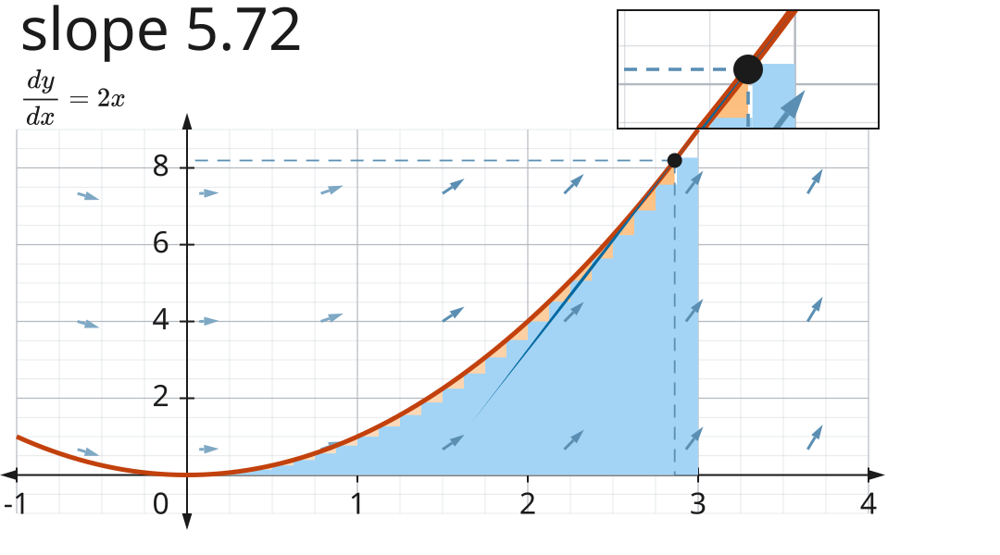
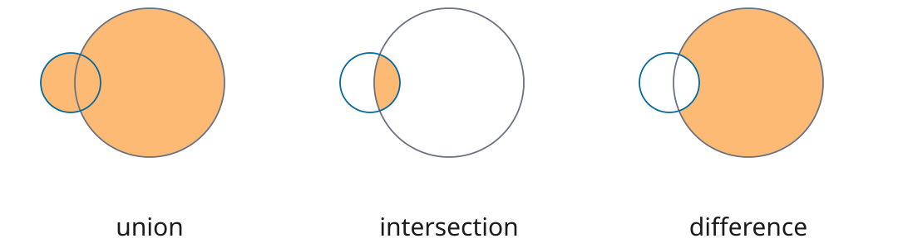
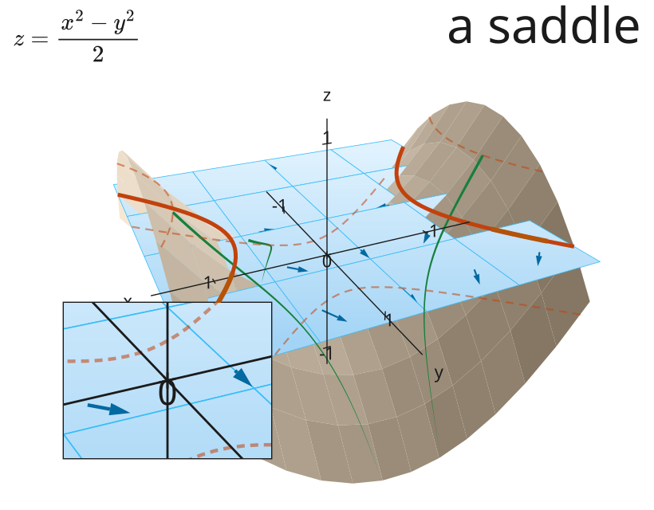
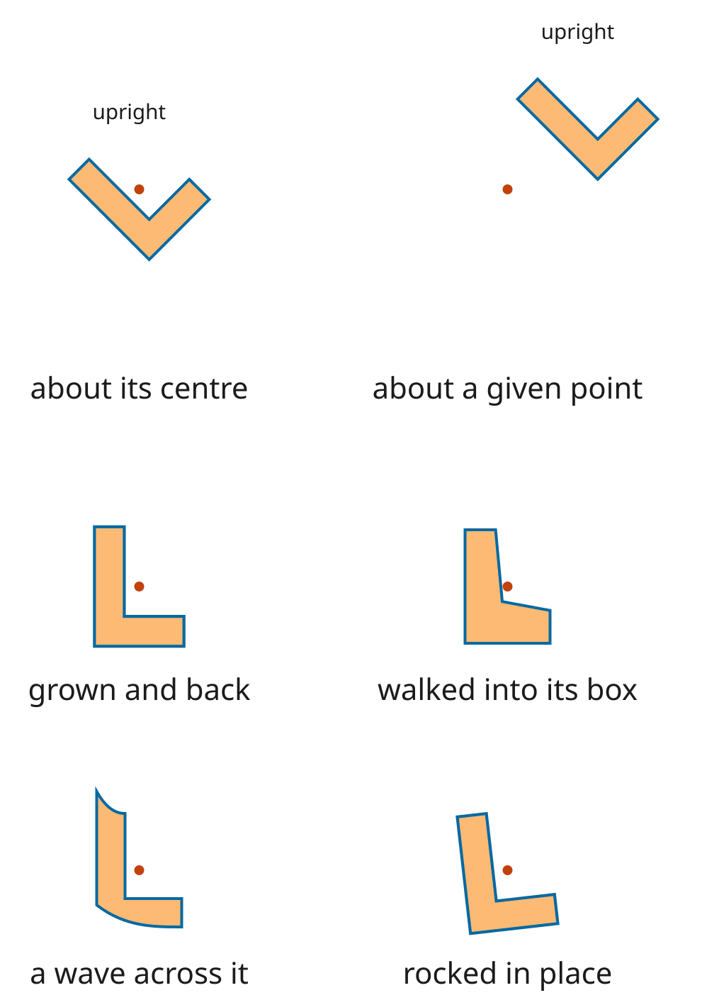

# @altpsyche/maths

This is the maths behind the figures on [altpsyche.dev](https://altpsyche.dev).

You describe a picture in its own units, say what moves and when, then ask it for a time. You get
back a flat list of things to draw. You choose what draws them: the package writes SVG for a page
and paints a canvas for a recorder, and both read the same list.



That is one figure at one moment of its run. Watch it from the start and the grid fades in, the axes
draw themselves, then the curve draws. A dot walks up the curve at a steady pace while the number in
the corner reads the slope underneath it. You never give any of it a size in pixels.

## Install

```sh
npm install @altpsyche/maths
```

You need Node 20 or newer. The one runtime dependency is MathJax, and only the typesetting call
loads it, so a figure with no equations in it never reaches that code.

## A whole figure

```ts
import { Timeline, circle, draw, group, marksAt, shape, svgMarkup, vec2, viewAt } from '@altpsyche/maths';

const figure = {
  extent: { width: 16, height: 9 },
  still: 1,
  scene: group('fig', [shape('ring', circle(vec2(0, 0), 3), { stroke: { colour: '#fff', width: 0.05 } })]),
  timeline: Timeline.empty().play(draw('fig/ring'), 1),
};

svgMarkup(marksAt(figure, 0.5), viewAt(figure, 0.5, 640, 360), 640, 360);
```

Ask for half a second and you get half a ring. Ask for that time again and you get the same half
ring, because `marksAt` is a pure function of the time you hand it.

## What you can draw

**Graphs, and the calculus you read off them.** You get axes with their ticks and numbers, and a
plotted function cut where it leaves the frame. You can shade the region under the curve, draw the
tangent at a point, brace a rise and count a number up to it.



**Shapes combined.** You can take the union, the overlap or the difference of closed loops of
cubics, and the answer can carry a hole where neither input had one. When the pieces will not join
into a loop, the call stops and tells you how far apart the ends it had are.



**Surfaces and vectors in space.** You hold the camera. You get a surface as a grid of cells sorted
back to front, the curve where a plane cuts it, three axes, and a field of arrows. Every builder
that works in space hands back the same flat marks a graph does, so the same animations reach both.



**Motion.** Fifteen animations play over a timeline, in order, together, or staggered down a row.
You can typeset mathematics from LaTeX and walk it glyph by glyph into the next expression. You can
point the view at a moving thing and let it follow, and you can walk a figure a frame at a time to
hand to a recorder.

## What you can't do, and why

**A mark asks only for what both painters can do.** You get no filters, no blend modes and no
clipping. A figure that reached for something only SVG has would look right on a page and lose it
without a word in a recording.

**A colour is flat.** You get no gradients, and this one is not the rule above. Both painters draw a
gradient, but each names one its own way, and a colour here is text that both take as it stands.

**A figure never reads the page.** You hand colours in as text. The package holds no palette and
asks no browser for a computed style.

**A stroke keeps one width along its whole length.** A tapering line needs a renderer of its own,
and neither painter here is one.

**No screenshot gates this package.** Every claim it makes is a list of marks or a number, so the
whole suite runs without a browser. A claim that needs a browser is a claim about a consumer.

## Where to go next

Read [docs/GUIDE.md](docs/GUIDE.md) first. It teaches the package: what a figure is, how to draw one
and move it, and what each part is for.

[docs/REFERENCE.md](docs/REFERENCE.md) gives you one entry per name, for looking up what a call
takes once you know which call you want.

[DESIGN.md](DESIGN.md) tells you why the package is built this way, and what it will not become.

`index.ts` is the whole public surface. Nothing outside the package reaches a file inside it by
path, and a test holds that.

A line runs through the middle. Below it sit values and timing: vectors, a transform, the four
easing curves, and a value walked between keys. Above it sit figures and painters. Nothing below the
line imports anything above it, and a test says so.

MIT.
