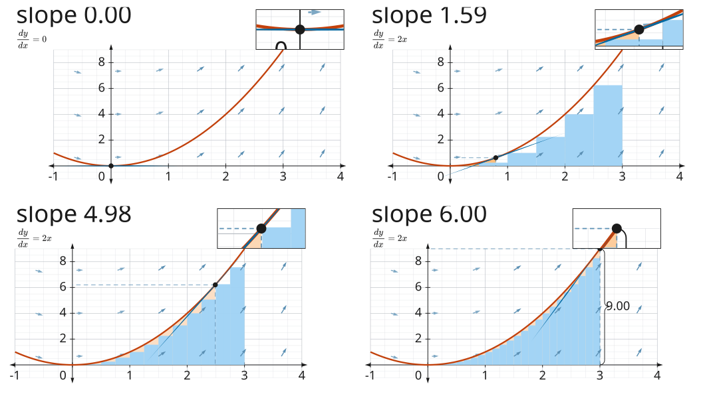

# @altpsyche/maths

The mathematics the figures on [altpsyche.dev](https://altpsyche.dev) are drawn from.

A **figure** is a picture that moves and explains itself. Asking one for a time gives back a
flat list of **marks**, and a **painter** turns marks into something a reader can see.

```ts
import { Timeline, at, circle, draw, group, shape, svgMarkup, vec2, viewMatrix } from '@altpsyche/maths';

const figure = {
  extent: { width: 16, height: 9 },
  still: 1,
  scene: group('fig', [shape('ring', circle(vec2(0, 0), 3), { stroke: { colour: '#fff', width: 0.05 } })]),
  timeline: Timeline.empty().play(draw('fig/ring'), 1),
};

svgMarkup(at(figure, 0.5), viewMatrix(figure.extent, 'contain', 640, 360), 640, 360);
```

## Axes and a plotted function


The picture arrives rather than appearing. The grid fades, the axes draw on, their labels come in one
after another, the curve draws, the dot grows out of the origin, and the dot is pointed at where the
slope is nothing. Then it walks the curve at one speed and flashes at the top. The number in the
corner is a value of the typeset rule under it.

```ts
import { axes, coordsOf, group, interval, numberPlane, plot, scaleOf, shape } from '@altpsyche/maths';

const coords = coordsOf(
  scaleOf(interval(-1, 4), interval(-4.6, 4.6)),
  scaleOf(interval(-1, 9), interval(-2.4, 2.4))
);

group('graph', [
  numberPlane('grid', coords, { stroke: faint, minors: 4 }),
  axes('axes', coords, { stroke: pen, fill: ink, size: 0.26, tip: 0.18 }),
  shape('curve', plot(coords, (x) => x * x), { stroke: drawn }),
]);
```

A **scale** is the run of numbers an axis counts through and where that run lands in figure units.
Two of them are a **coords**, and `pointOf` reads a pair of graph numbers as a point. The steps
between ticks are one, two or five times a power of ten, because those are the numbers a reader
adds up in their head.

`plot` samples a function at a fixed count and joins the samples with cubics that leave each one at
the slope the function has there. It cuts the curve where the curve leaves the graph, so a pole
breaks in two instead of drawing a line up the picture, and the cut end sits on the edge rather
than a sample short of it. The curve above is cut at x = 3, where the parabola meets the 9 its y
axis stops at.

`areaUnder` closes the region between a curve and a level line, `riemannBars` draws the bars the
region is the limit of at the left edge, the right edge or the middle of each one, and `tangentAt`
lays the tangent along the curve, cut where it leaves the graph. `slopeOf` reads the slope itself,
which is what the number in the corner is.



Four times of one figure, side by side: the picture arrived, the beat at the stationary point, half
way up, and the top. A moving picture in a README needs a GIF and this package has no encoder, so the
strip shows the motion in a still.

## Equations

`equationFromTex` typesets an expression with MathJax and reads the SVG the typesetter wrote back as
marks, one per glyph. `equationNode` places those marks in a figure, fitted inside a box and centred
on a point. It fits the width as well as the height, because an expression six times wider than it is
tall runs off the sides of a figure the moment the height alone decides its size.

```ts
import { equationFromTex, equationNode, vec2 } from '@altpsyche/maths';

const rule = await equationFromTex('\\frac{dy}{dx} = 2x');

equationNode('rule', rule, {
  at: vec2(-4.27, 1.74),
  width: 1.2,
  height: 0.6,
  fill: { colour: '#1b1b1b' },
});
```

An equation is paths on the page as well as in a recording, which is what stops one expression having
two pictures free to disagree. A glyph is an outline rather than a letter, so no font has to be
installed anywhere and the LaTeX is the label the picture carries for a reader.

MathJax is the one runtime dependency and the typesetting call is what loads it. Importing the door
reaches none of it, so a consumer who draws figures and typesets nothing pays nothing. What that
costs is that typesetting answers with a promise.

Three things stop a typeset expression rather than being drawn, and each names what it found. A TeX
error carries the typesetter's own message. A character the font has no outline for arrives as text,
which would draw with whatever font a browser had and draw nothing at all in a recording. An
undefined macro is not an error at all, because MathJax draws the macro's own name in red, so a typo
would otherwise ship as a red word inside the picture.

## The animations

`fadeIn`, `fadeOut`, `fadeTo`, `draw`, `morph`, `moveBy`, `rotate`, `scale`, `growFrom`, `moveAlong`,
`indicate`, `flash` and `circumscribe`. A `Timeline` plays them in order, plays several `together`, or
`stagger`s a row so its parts arrive one after another.

A turn and a growth happen about a point the marks decide for themselves, which is the middle of the
box round them. `boundsOf` is that box, worked out from where each piece of the curve turns back on
itself rather than from the points the curve is written from.

`moveAlong` carries a mark along a path at one speed, measured by the path's length. Even steps in a
curve's own parameter are uneven steps along the curve: a step covers more of it where the curve is
moving fast, which on a quarter circle is a 6.9% difference between the longest step and the shortest
and on the demo's own walk is 82%.

Both pictures are written by `svgMarkup`, which needs no browser, so `npm run demos` regenerates
them and a test compares the bytes against the committed files.

## What it is built on

**A figure at a time is data.** `at(figure, seconds)` is the whole public surface, and it is a
pure function: ask for four seconds and it gives the picture at four seconds whatever it gave
before. A page playing forward, a reader dragging a scrub bar backwards and a recorder walking
a fixed step are three consumers of one answer.

**Everything is a cubic**, a straight line included. That is what lets one shape be walked into
another point by point, with no case where a line has to become an arc.

**A mark may only ask for what both painters can do**, rather than the union of them. There are
no filters, no blend modes, no clipping and no gradients, because a figure reaching for
something only SVG has would look right on a page and lose it without a word in a recording.

**A figure never reads the page.** Colours arrive as a palette the caller hands in.

## The two painters

`svgMarkup` and `paintSvg` write SVG, which is what a figure on a page is: the text is text, CSS
reaches it, and the markup can be written with no browser at all. `paintCanvas` paints the same
marks onto a two-dimensional canvas, which is what a recording needs, because an encoder takes
one surface. A test holds the two to emitting the same geometry and the same style for every
mark.

## The way in

`pathFromData` reads an SVG `d` attribute as a path, which is the inverse of what the SVG painter
writes. Without it the only shapes that exist are the ones the builders here make, so a glyph from
a typesetter or an outline from a drawing program could not be trimmed, aligned or walked into
another shape, and those are the operations this package is for. Every command is read, elliptical
arcs included, and a command it does not know stops the read rather than being skipped.

## The line through the package

**Values and timing** are below it: vectors, a transform, the four curves a change can travel
along, and a value walked between keys. That half changes almost never. **Figures and painters**
are above it. Nothing below the line imports anything above it, and a test says so.

One door. MIT.
