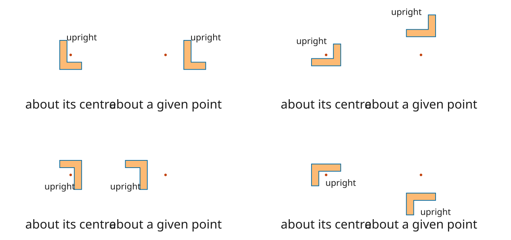
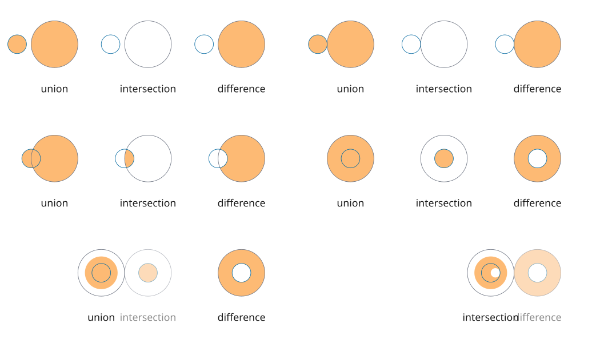
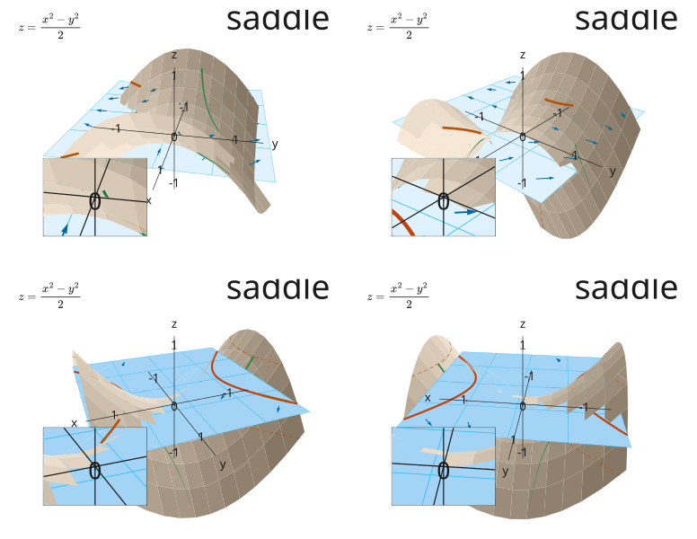

# Guide

This page teaches the package in the order the ideas depend on each other. Each technical term is
defined where it first appears. [README.md](../README.md) states what the package is,
[REFERENCE.md](REFERENCE.md) carries one entry per name at the door, and [DESIGN.md](../DESIGN.md)
states why the design is what it is.

## Figures, marks and painters

A **figure** is a description of a picture over time. Evaluating a figure at a time yields a flat
array of **marks**. A mark is one drawn item: an outline with a fill, a stroke, or both, or a piece
of text. A **painter** consumes marks and produces something a reader can see.

No part of that requires a browser. A figure at a time is an array, and an array is countable in a
test.

```ts
import { circle, colourFrom, flatten, group, marksAt, shape, vec2 } from '@altpsyche/maths';

const figure = {
  extent: { width: 16, height: 9 },
  still: 0,
  scene: group('fig', [shape('ring', circle(vec2(0, 0), 3), { stroke: { colour: colourFrom('#fff'), width: 0.05 } })]),
};

marksAt(figure, 0);
```

`marksAt` is a pure function of the time. Two evaluations at one time produce identical arrays. A
page playing forward, a reader dragging a scrub bar backward and a recorder stepping at a fixed rate
therefore read one figure.

## Notation used in the examples

The examples build on each other and share four styles, one path and one canvas context, defined
here. A **style** is a fill, a stroke, or both. The colours belong to the author: the package holds
no palette and reads none from the page. `colourFrom` builds one from its text, and the second
argument is the CSS custom property a page overrides it under.

```ts
import { circle, colourFrom, vec2 } from '@altpsyche/maths';
import type { CanvasLike, Fill, Path, Stroke } from '@altpsyche/maths';

const ink: Fill = { colour: colourFrom('#1b1b1b', 'ink') };
const pen: Stroke = { colour: colourFrom('#1b1b1b', 'ink'), width: 0.04 };
const faint: Stroke = { colour: colourFrom('#b4b9c0', 'mist'), width: 0.02 };
const drawn: Stroke = { colour: colourFrom('#c2410c', 'ember'), width: 0.05 };
const path: Path = circle(vec2(0, 0), 3);

// The two-dimensional context of a canvas the caller holds, which a recorder paints into.
declare const context: CanvasLike;
```

## Figure units and the extent

A figure is measured in its own units. The **extent** is the width and height of the picture in
those units. No quantity in a figure is expressed in pixels.

One figure therefore draws at 640 across in a chapter and at 2160 by 3840 in a reel. The numbers in
the figure are unchanged; only the matrix mapping them to a surface differs.

```ts
import { viewMatrix } from '@altpsyche/maths';

const view = viewMatrix({ width: 16, height: 9 }, 'contain', 640, 360);
```

`contain` fits the whole extent inside the surface. `cover` fills the surface and allows the extent
to run past its edges.

The **frame** is the rectangle a figure is drawn into. An extent may carry a `centre`, which is the
point of the figure sitting at the middle of the frame. The extent may be a function of the
surface's aspect ratio and of the time, which is how a view follows a moving subject.

## A mark placed against the frame

A **frame expression** is the width, the height, the aspect or the centre of the frame, read while
the figure is drawn. A mark whose place is built from one moves when the frame changes shape, which
is what a figure drawn over something else needs: a mark put at a place inside that other picture
would need the camera it is drawn through, and nothing can read one.

The frame is the extent the figure declares, resolved at the aspect being drawn. It is never the
extent a view move has left, because a view that follows a mark reads the marks and a mark reading
that extent would ask for what is being built.

```ts
import { marksAt, resolveFigure } from '@altpsyche/maths';
import type { Expression, FigureRecord } from '@altpsyche/maths';

/** A share of the frame as a length, which is what sizes a mark that fills part of it. */
const shareOfWidth = (of: number): Expression => ({
  kind: 'arithmetic',
  operator: '*',
  left: of,
  right: { kind: 'frame', name: 'width' },
});

const plated: FigureRecord = {
  extent: { kind: 'matchingAspect', height: 6 },
  scene: {
    kind: 'shape',
    name: 'plate',
    path: {
      kind: 'rect',
      corner: { kind: 'point', x: shareOfWidth(-0.45), y: -2.7 },
      width: shareOfWidth(0.9),
      height: 5.4,
    },
    style: { fill: ink },
  },
  still: 0,
};

const platedFigure = resolveFigure(plated);
const wide = marksAt(platedFigure, 0, 16 / 9);
const tall = marksAt(platedFigure, 0, 9 / 16);
```

The plate is 9.6 units across in `wide` and 3.0375 across in `tall`, which is nine tenths of a frame
six units tall at each shape. A mark written in the figure's own units is the same mark in both.

`marksAt` takes the aspect as its third argument, and `framesOf` and the painters' own callers pass
the shape of the surface they are drawing on. A figure whose declared extent is already an extent
has one frame at every aspect and may be asked for its marks with none. A figure whose declared
extent is a function of the aspect has no frame without one, and a frame expression under it is
refused with the measure it was asked for named.

The `centre` measure answers a place rather than a number, so a figure whose declared extent sits
off the origin builds a fraction of the frame from `centre` and `width` together.

## Painters

`svgMarkup` returns one SVG document as a string. It requires no browser, so a test reads the text
it produced.

```ts
import { marksAt, svgMarkup, viewAt } from '@altpsyche/maths';

svgMarkup(marksAt(figure, 0.5), viewAt(figure, 0.5, 640, 360), 640, 360);
```

`viewAt` resolves the figure's own extent at the time given, so a moving view cannot be read at one
time and painted at another. `viewMatrix` takes an extent directly, for a caller holding one.

`paintSvg` replaces the children of elements the caller supplies, for a page updating in place.
`paintCanvas` draws into a two-dimensional context, which is what a recorder needs. Coordinates
reach both painters rounded to three decimal places. One test holds the two to the same geometry
within a thousandth of a pixel, and to the same style exactly.

## Nodes and names

A figure's `scene` is a tree of **nodes**. `shape` is one outline, `text` is one piece of text, and
`group` holds children under a name. `flatten` walks the tree and returns marks.

Each mark carries an identifier built from the names above it, joined by slashes. An animation names
a node and reaches every mark beneath it.

```ts
import { group, shape, text, vec2 } from '@altpsyche/maths';

group('graph', [
  shape('curve', path, { stroke: pen }),
  group('labels', [text('x', vec2(4, 0), 'x', 0.3, { fill: ink })]),
]);
```

The curve above is `graph/curve` and the letter is `graph/labels/x`.

A group may carry a transform and a style. A style set on a group descends to its children unless a
child sets its own. A group that scales multiplies the stroke widths beneath it by the same factor
it multiplies everything else, since a stroke width is in figure units.

## Text sizes and lines

A **text scale** is four sizes, one per role, each a fixed ratio above the one below it. The roles
are `title`, `note`, `label` and `tick`, largest first. A title says what the picture is, a note is a
remark written beside the picture, a label is a tag on a mark, and a tick is a number on an axis.

`textScale` builds the four from the size the ticks take. The ratio is `TEXT_RATIO`, the square root
of two, so two steps double: a note is twice a tick and a title is twice a label. A figure names a
role rather than a number, and the hierarchy is then the same wherever it is drawn.

```ts
import { group, text, textScale, vec2 } from '@altpsyche/maths';

const type = textScale(0.32);

group('graph', [
  text('reading', vec2(-4, 2.4), 'slope 2.00', type.note, { fill: ink }),
  text('mark', vec2(1, 0.2), '1', type.tick, { fill: ink }),
]);
```

A size is in figure units, so a figure drawn in different units needs a scale of its own rather than
the same four numbers.

A newline in a text node's own string starts another line under the first. `leading` is how far
apart two baselines sit, in the same units as the size, and it defaults to `LEADING` times the size,
which is six fifths. A node of several lines flattens into one text mark per line, named `0`, `1`
and so on under the node's own name, so a mark never carries a newline.

```ts
text('title', vec2(-4, 2.6), 'a saddle\ncut by a plane', type.title, { fill: ink, leading: 0.8 });
```

The two marks above are `title/0` and `title/1`. A one-line text keeps its own name and draws the
one mark it always drew.

## Paths

A **path** is a sequence of **subpaths**. A subpath is a start point followed by a sequence of
**cubic Bézier segments**, closed or open. A segment stores its two control points and its endpoint,
and not its start, so the functions evaluating one take that start as an argument.

All geometry is cubic, a straight line included. A straight segment places its controls at a third
and two thirds along, which is the placement leaving the parameterisation even. Uniform
representation is what allows any shape to be interpolated into any other point by point, with no
case where a line becomes an arc.

```ts
import { arc, circle, line, polygon, polyline, rect, vec2 } from '@altpsyche/maths';

line(vec2(0, 0), vec2(3, 4));
polyline([vec2(0, 0), vec2(1, 2), vec2(3, 1)]);
polygon([vec2(0, 0), vec2(1, 0), vec2(1, 1)]);
rect(vec2(0, 0), 4, 2);
circle(vec2(0, 0), 1);
arc(vec2(0, 0), 1, 0, Math.PI / 2);
```

A circle is four cubic quarters. No cubic is a circular arc exactly. For a segment spanning an angle
θ the control distance is (4/3)·tan(θ/4). For a quarter turn that bounds the radial error at
2.7 × 10⁻⁴ times the radius. The suite holds the drawn edge between 2.6 × 10⁻⁴ and 2.8 × 10⁻⁴.
`arc` subdivides any sweep into segments of at most a quarter turn and derives the control distance
per segment, since the error grows with the angle covered.

`pathFromData` reads an SVG `d` attribute as a path, including the elliptical arc commands, by the
conversion the specification itself gives. An unknown command halts the read rather than being
skipped. Without it the only available shapes are the ones the builders here produce.

`lengthOf` returns arc length, and reads slightly short by the chord error of its sampling.
`pointAlong` returns the point at a fraction of that length rather than of the curve's parameter.
`trimPath` cuts a path to a fraction of its length.

## Stroke widths

A **stroke width** is one number in figure units, or a **taper**. A taper is the width where the
path starts, the width where it ends, and the name of the curve the width leaves the first along.
The curve is named rather than passed as a function, so a figure written out as data can carry one.

```ts
import { outlinePath, widthAt, vec2, line } from '@altpsyche/maths';

const swell = { from: 0, to: 0.2, curve: 'thereAndBack' } as const;
widthAt(swell, 0.5);
outlinePath(line(vec2(0, 0), vec2(2, 0)), swell);
```

Neither painter strokes at two widths, so a tapered stroke is drawn as the filled outline of its own
path. `outlinePath` builds that outline: an open subpath becomes one loop, the left side out, the
cap, the right side back and the cap at the start, and a closed subpath becomes two loops wound
against each other, which the nonzero rule reads as a ring. The caps, the joins and the miter limit
are the SVG specification's, and so are the defaults: a butt cap, a miter join and a limit of four.

The outline is built on a flattening, since the offset of a cubic is not a cubic. Its tolerance
defaults to a thousandth of a figure unit, which is a tenth of a pixel at a hundred pixels to the
unit. The width is read at each point of that flattening, and a run is split further where the width
along it bends, so a stroke that swells has points to swell at even where the path itself is
straight.

`marksAt` takes the outline after the timeline has run. An animation therefore still sees the
centreline, so `draw` over a tapered line trims that centreline and the outline follows it rather
than being opened up along one side. `widthAt` reads the width at a fraction of the length,
`widestWidth` picks the one number a caller that needs one reads, and `outlinedMarks` is the pass
itself, which a list with no taper in it comes out of unchanged.

## Graphs

A **scale** is a pair of intervals: the numbers an axis counts through, and where those numbers land
in figure units. Two scales together are a **coords**.

```ts
import { coordsOf, interval, pointOf, scaleOf } from '@altpsyche/maths';

const coords = coordsOf(
  scaleOf(interval(-1, 4), interval(-4.6, 4.6)),
  scaleOf(interval(-1, 9), interval(-2.4, 2.4))
);

pointOf(coords, 2, 4);
```

`pointOf` maps a pair of graph numbers to a point in figure units. `toUnits` and `toGraph` map one
axis at a time, in either direction. The mapping is a value the caller holds rather than state read
back out of a drawn group, so a curve drawn over axes that were never drawn works.


`numberPlane` draws the grid, `axes` draws both axes with their arrow heads, and `numberLine` draws
one axis alone. A **tick** is one mark along an axis together with the number it stands for.

```ts
import { axes, numberPlane, plot, shape } from '@altpsyche/maths';

numberPlane('grid', coords, { stroke: faint, minors: 4 });
axes('axes', coords, { stroke: pen, fill: ink, size: 0.26, tip: 0.18 });
shape('curve', plot(coords, (x) => x * x), { stroke: drawn });
```

`ticksOn` selects the ticks. The step is one, two or five times a power of ten, which are the steps
a reader accumulates mentally. `labelFor` writes a tick's value to the number of decimals its step
requires. The count comes from the step rather than from the value, so every label on an axis has
one width.

`plot` samples a function and emits one Hermite cubic per interval. The control points sit a third
of the way along in x and carry the sample's own slope, so the curve passes through both samples at
both slopes. `plot` cuts the curve where it leaves the graph, so a pole breaks into two subpaths
rather than drawing a line across the picture.

`areaUnder` closes the region between a plotted curve and a level line, taking the path the caller
drew, so the region's top and the curve are one geometry. `riemannBars` draws the bars whose limit
that region is. `tangentAt` clips the tangent line to the graph analytically, since a straight line
crosses each edge once. All three readers take the plotted path rather than the function behind it:
`slopeOf` reads the slope off the cubic covering the x it is asked for, and hands back `NaN` where
the curve does not reach that x.

## Timelines and animations

An **animation** maps an array of marks and a fraction of a span to an array of marks. A **span** is
one animation over a stretch of time. A **timeline** is an ordered set of spans.

```ts
import { Timeline, draw, fadeIn, moveBy, vec2 } from '@altpsyche/maths';

const timeline = Timeline.empty()
  .play(fadeIn('graph/grid'), 0.6)
  .play(draw('graph/curve'), 1.2)
  .together([fadeIn('graph/axes'), moveBy('graph/dot', vec2(1, 0))], 0.8);
```

`play` runs one animation after the previous span. `together` runs several over one span. `stagger`
offsets a row of them so the parts arrive in succession.


Four times of one figure. A moving picture needs a GIF and this package has no encoder, so a still
shows motion as a strip: several times of one figure laid out side by side. Every strip on this page
is produced by the same walk a recorder uses.

A span that has not started applies at zero and a span already finished applies in full. That makes
a figure's output a function of the time asked for and of nothing else.

The animations are `fadeIn`, `fadeOut`, `fadeTo`, `draw`, `morph`, `morphEquation`, `countTo`,
`moveBy`, `rotate`, `scale`, `growFrom`, `moveAlong`, `indicate`, `flash` and `circumscribe`.

An **easing curve** maps the fraction of a span to the fraction of the change. The four are
`linear`, `easeIn`, `easeOut` and `smoothstep`, the last being Perlin's cubic, flat at both ends.
`curveFor` selects among them from whether each end is flat.

`moveAlong` carries a mark along a path at constant speed, measured by arc length. Uniform steps in
a curve's parameter are non-uniform steps along the curve, since a step covers more length where the
first derivative is larger.

`rotate` turns the marks a name reaches. The pivot is the centre of the bounding box of those marks
unless the figure names one. It is read from the marks as they arrive rather than after the turn has
moved them.


A rotation does not thicken a line. A stroke width is multiplied by the transform's scale factor,
which for a rotation is one.



The quarters of the turn. The full turn is omitted, since this figure declares itself a loop and its
frame at the duration is its frame at zero.

## Tracks

A **track** is a value interpolated between **keys**. A key is a time and a value. `sampleTrack`
reads the value at a time, holding the nearest key outside the keyed range.

A figure's `scene` may be a function of the time and of the sampled track values. That is how a
picture whose geometry depends on a number is built: the scene derives the geometry from the number.

```ts
import { sampleTrack } from '@altpsyche/maths';

const spin = [
  { time: 0, value: 0, smooth: true },
  { time: 2, value: 1, smooth: true },
];

sampleTrack(spin, 1);
```

A key marked `smooth` is flat at that time, which eases the segments on either side. A key left
plain runs straight into the next.

A track and a span are separate clocks. A span's eased fraction and a track's value are unrelated
quantities, so a subject driven by both is free to disagree with itself. Drive one subject with one
of them.

## A moving view

A view move is a timeline entry. It sits in the same list the animations do, so a camera move can be
told to start after an entrance or to overlap one, and `after` and `stagger` read it the way they
read a fade.

Three forms cover what a figure needs. `moveView` walks each field of the extent it is handed to the
one it names and leaves the fields it does not, so a pan writes a centre alone. `followView` holds a
named mark within a margin of the middle and pushes no further, stopping where its room runs out.
`frameView` grows the frame to cover the named marks rather than fitting it to them, so the shape it
was handed is the shape it keeps and the picture does not stretch as the marks move.

```ts
import { Timeline, fadeIn, followView, moveView, vec2 } from '@altpsyche/maths';

// The dot is followed from the first frame, held within a unit of the middle, and
// the camera pushes in on it once the picture has arrived.
const viewed = Timeline.empty()
  .play(followView('fig/dot', { within: 1, axis: 'x' }), 0)
  .play(fadeIn('fig/grid'), 0.6)
  .play(moveView({ width: 6, height: 3 }), 1.2, { after: 0.4 });
```

The extent a figure declares is the base those entries fold over rather than the answer. A figure
with no view entry keeps its declared extent throughout, and a finished view entry stays applied in
full, which is the rule every mark animation already follows.

`extentAt(figure, seconds, aspect)` answers for how much of the world a figure shows at a time, after
its view entries. `viewAt(figure, seconds, width, height)` is that call and `viewMatrix` together, so
the extent and the matrix cannot disagree: asked for the extent at one time and the marks at another,
a figure would draw a frame around the wrong picture.

`fractionOf` resolves a point as a fraction across and up the extent it is handed, with the origin
at the bottom left. A mark placed that way is in screen space and holds its place on the surface
while the picture moves beneath it. A scene placing a mark that way computes the frame the way its
view entry does rather than calling `extentAt`, since a view that follows something reads the marks
and the scene would be asking for what is being built.

## Clips and insets

A clip is the rectangle a mark is drawn inside, with everything of the mark outside that rectangle
cut away. It is a `Bounds`, which is an `x` interval and a `y` interval, and it is a rectangle and no
other shape: a path clip needs a winding number counted, which is a stencil on a graphics card, where
a box is the scissor test every device already has.

The rectangle is in the figure's own units rather than the mark's, which is the one place a mark
departs from carrying its geometry through every transform above it. A transform that turns takes a
rectangle to a shape with corners off the axes, so a clip that rode the transform down would be a
rectangle only until a group turned.

```ts
import { circle, group, interval, shape, vec2 } from '@altpsyche/maths';

const window = { x: interval(-2, 2), y: interval(-1, 1) };

// Both discs are cut to the window, since a clip on a group reaches every mark
// under it.
const clipped = group('band', [
  shape('left', circle(vec2(-1, 0), 0.8), { fill: ink }),
  shape('right', circle(vec2(1, 0), 0.8), { fill: ink }),
], { style: { clip: window } });
```

A clip inside a clip is the box both hold, since a group cannot show what the group above it has
already cut away, and two clips that miss each other leave nothing under them at all.

A shape whose whole reach falls outside its clip is left out of the mark list rather than drawn
invisibly, and the reach counts half a stroke width past the geometry, since a line lying along the
edge of its clip has half of it inside. A text mark stays whatever its clip says: a text mark reaches
only as far as its own anchor here, because how wide some text is depends on which fonts the machine
has, so dropping one on an anchor outside the clip would cut a line whose letters run back inside on
the machine that has the font.

An inset is a second view of the same figure, magnified and drawn into a rectangle of its own frame.
It reads the marks the figure has already built rather than building the tree again, so what it shows
is the picture at that time and not a second picture that could disagree about it.

```ts
import { followView, interval, vec2 } from '@altpsyche/maths';
import type { Inset } from '@altpsyche/maths';

const lens: Inset = {
  // A window on the picture 1.4 by 0.63, drawn into a panel 2.8 by 1.26, so the
  // magnification is exactly 2.
  shows: { width: 1.4, height: 0.63 },
  into: { x: interval(1.9, 4.7), y: interval(1.62, 2.88) },
  // Applied in full at every time, with no span and no easing: an inset that
  // eased into following would show the wrong part of the picture while it
  // caught up.
  view: followView('fig/dot'),
  name: 'fig/lens',
  hides: ['fig/panel'],
};
```

The border and the ground behind a panel are the figure's own marks, since a frame round a picture is
a shape and this package already has shapes. `hides` is what keeps the inset from magnifying them: an
inset over the part of the picture its own border sits in would paint a picture of itself. Each
inset's marks carry the id it is named by in front of the id of the mark they copy, so `fig/lens`
gives `fig/lens/fig/dot`, and they carry the opacity of the marks they copy, so the picture inside a
panel fades in as the picture does.

## Annotations

An annotation is composed from marks rather than being a mark of its own. Each returns a group, so
an animation naming it reaches every part.

```ts
import { arrow, brace, callout, countTo, dot, labelFor, vec2 } from '@altpsyche/maths';

arrow('pointer', vec2(0, 0), vec2(2, 1), { stroke: pen });
dot('here', vec2(2, 1), 0.08, ink);
brace('rise', vec2(3, 9), vec2(3, 0), '9.00', { depth: 0.3, padding: 0.28, stroke: pen, fill: ink, size: 0.3 });
countTo('rise/word', 0, 9, (value) => labelFor(value, 0.01));
```

An arrow is a shaft and a head. One path cannot be stroked along its length and filled at its tip,
so an arrow is two marks under one name. The shaft stops where the head begins, since a shaft drawn
to the point shows through a head that is not fully opaque.

A brace is one open subpath of six segments: a curl at each end, a run along at the curl's height,
and two curls meeting at the tip. The tip is a corner rather than a smooth turn, which identifies
the point being indicated. The tip stands at the depth requested whatever the span. Only the curl
narrows as the span shortens, bounded at a quarter of the span so two curls cannot cross.

`countTo` writes the value a count has reached into a text mark. The formatting is the caller's, so
a count of a length and a count of a population round differently.

A label is anchored and never measured. No part of a figure's layout may depend on the width of
text, since that width depends on the fonts installed on the machine.

## Equations

A **glyph** is one drawn character. `equationFromTex` typesets an expression with MathJax and reads
the SVG the typesetter produced back as marks, one path mark per glyph.

```ts
import { equationFromTex, equationNode, vec2 } from '@altpsyche/maths';

const rule = await equationFromTex('\\frac{dy}{dx} = 2x');

equationNode('rule', rule, { at: vec2(-4.27, 1.74), width: 1.2, height: 0.6, fill: ink });
```

`equationNode` places those marks in a figure, fitted inside a box. It fits the width as well as the
height, since an expression six times wider than it is tall would otherwise run past the sides of a
narrow figure. The group carries the transform and the glyphs keep the typesetter's own coordinates.

A glyph is an outline rather than a character. No font need be installed anywhere, and one
expression draws identically on a page and in a recording.

MathJax is the single runtime dependency, loaded by a dynamic import inside the typesetting call.
Importing the door reaches none of its 41 MB. The cost is that typesetting returns a promise.

`morphEquation` walks one expression into another. The shared glyphs hold their positions and only
the difference moves. `matchGlyphs` pairs the glyphs of one expression with those of the other by
the token in each mark's name.

```ts
import { equationFromTex, equationNode, group, morphEquation, vec2 } from '@altpsyche/maths';

const box = { at: vec2(-4.86, 1.74), align: 'start', width: 1.2, height: 0.6, fill: ink } as const;

group('rule', [
  equationNode('at-rest', await equationFromTex('\\frac{dy}{dx} = 0'), box),
  equationNode('moving', await equationFromTex('\\frac{dy}{dx} = 2x'), box),
]);

morphEquation('rule/at-rest', 'rule/moving');
```

Hang both expressions from one edge with `align`. Centred instead, the shared part slides sideways
as the wider expression arrives.

Three conditions halt a typeset expression, and each reports what it found. A TeX error carries the
typesetter's own message. A character with no outline arrives as text, which would draw in whatever
font the browser had. An undefined macro is not an error to MathJax: it draws the macro's name in
red, so a typo would otherwise ship inside the picture.

## Boolean operations


```ts
import { circle, differenceOf, intersectionOf, unionOf, vec2 } from '@altpsyche/maths';

const first = circle(vec2(0, 0), 0.9);
const second = circle(vec2(-0.6, 0), 0.36);

unionOf(first, second);
intersectionOf(first, second);
differenceOf(first, second);
```

`unionOf` returns everything either path covers, `intersectionOf` only what both cover, and
`differenceOf` the first with the second removed.

Each operand is closed loops that do not self-intersect. An open loop is closed by a straight run
back to its start before anything else happens.

A result may contain a hole where neither operand had one. A disc with a smaller disc removed is a
ring: an outer loop and an inner loop wound in opposite directions.

Four public calls do the work. `curveCrossings` locates the intersections of two cubics, refined by
Newton's method from a subdivision search. `cutPath` inserts a cut at every crossing, after which
every piece lies wholly inside the other path or wholly outside it. `containsPoint` decides which,
by the nonzero winding number of the other path about the piece's midpoint. `areaOf` returns the
enclosed area in closed form.

Proximity throughout is a distance in figure units, `TOLERANCE = 1e-6` by default, rather than a
fraction of a length. When the kept pieces fail to close into a loop, the operation throws and the
message states the piece count and the distance between the two open ends. A shape drawn with a gap
and nothing reporting it is the one failure a caller cannot see.



A small disc traverses a larger one: disjoint, tangent at one point, crossing at two, and contained.
Those are the four configurations this class of code fails at silently.

## Fields

A **field** is a function from a position to a vector. The package stores no field. What it holds is
the sampling, the drawing and the integration.

```ts
import { streamlineOf, vec2, vectorField } from '@altpsyche/maths';

vectorField('slopes', coords, (at) => vec2(1, 2 * at.x), {
  lengthOf: (magnitude) => 0.3 / (1 + magnitude),
  colourFor: () => colourFrom('#0369a1', 'deep'),
  width: 0.012,
  resolution: 12,
});

streamlineOf((at) => vec2(1, 2 * at.x), vec2(0, 0), { step: 0.02, steps: 400 });
```

Arrow length and arrow colour are both the author's functions of the magnitude at that arrow's own
sample. A field drawn at true magnitudes is unreadable as soon as two samples differ by a factor of
ten.

An arrow's length is in figure units and only its direction comes from the field. A length in graph
units would draw a horizontal arrow several times longer than a vertical one of equal magnitude
wherever the two axes count at different rates. Samples sit at cell centres rather than on the grid
lines, which keeps the outer row and column inside the graph.

`streamlineOf` integrates the field by fourth-order Runge-Kutta and returns the points. The step is
a distance rather than a time, which keeps the points evenly spaced. Halving the step divides the
error along the curve by 15.1 and then 15.6, against the factor of 16 the order predicts. The step
is fixed and never adaptive: an adaptive step returns a different number of points as the field
changes, and one path is interpolated into another by pairing points.

## Space


A figure's **camera** is a value the caller holds. `camera3` returns where a point in space lands in
figure units, its depth along the view direction, and whether it lies in front of the near plane.

```ts
import { camera3, dot3, interval, perspective, polyline3, surface3, vec3 } from '@altpsyche/maths';

const camera = camera3({ eye: vec3(4, 4, 4), target: vec3(0, 0, 0), projection: perspective() });

polyline3('edge', [vec3(0, 0, 0), vec3(1, 1, 1)], camera, { stroke: pen });
dot3('corner', vec3(1, 1, 1), 0.05, ink, camera);
surface3('saddle', (u, v) => vec3(u, v, u * u - v * v), camera, {
  over: { u: interval(-1, 1), v: interval(-1, 1) },
  resolution: 12,
  shade: (amount) => ({ colour: { r: Math.round(150 + 90 * amount), g: 0, b: 0, a: 1 } }),
});
```

`perspective` divides by depth and `orthographic` does not, so the orthographic case has no near
plane and never clips. Depth is measured along the direction the camera looks rather than as
distance to the eye, since that is the quantity a depth sort orders by.

Every builder in space returns the same flat nodes everything else draws, so `fadeIn` and `draw`
reach a mark in space unchanged. Nothing in the marks, the tree or the painters knows that space
exists.

`scene3` orders pieces near over far, which is the painter's algorithm. Its limits are worth knowing
before it is used. Two pieces that pass through each other, and three that overlap cyclically, admit
no correct order, and no comparison of depths finds one. The answer is smaller pieces, which is why
`surfaceCells` cuts a surface into a grid. The sort is stable, so pieces at equal depth hold the
order the author gave and the picture does not flicker between frames.

A **cell** is one four-cornered piece of that grid, small enough to be treated as flat.

`sectionOf` finds the curve where a plane cuts a surface, by marching squares over the grid the
surface is drawn from. Every point it returns lies on the plane exactly. It does not lie on the
surface exactly: it sits on the chord between two samples, and halving the cell size quarters that
error.

`axes3` draws three axes with their ticks and numbers. `arrow3` and `fieldArrows3` draw a field in
space. An arrow there is measured in world units, since a distant arrow drawing shorter than a near
one of equal magnitude is what conveys depth. Its head remains in figure units, since the head is
drawn on the page.

Drive a camera with a track and never with an animation, for the reason tracks give above.



The quarters of one orbit. The eye returns to where it started. A test holds that by comparing the
marks at the end of the entrance against the marks one orbit later, mark for mark by name.

## Records

A **record** is a part of a figure written as data rather than built by a call. A node record is a
kind, a name and the parameters that kind takes, and `resolveNode` walks it into the node the calls
above build. Nothing in a record is a function, which is what lets the same figure be written to a
file and read back.

```ts
import { resolveNode, vec2 } from '@altpsyche/maths';
import type { NodeRecord } from '@altpsyche/maths';

const ring: NodeRecord = {
  kind: 'shape',
  name: 'ring',
  path: { kind: 'circle', centre: vec2(0, 0), radius: 3 },
  style: { stroke: pen },
};

resolveNode(ring);
```

`shape`, `text` and `group` are the kinds the tree itself has, and every other kind resolves into a
tree of those three. A path is a record of its own: a named form with parameters, the `d` attribute
of an SVG path, or the cubics written out. `resolvePath` reads one.

An **expression** is a parameter written as data. It is a literal, a track by name, a bound variable,
an arithmetic combination, a comparison with a choice, a member of a value, or a call to one of the
functions this package publishes. `EXPRESSION_FUNCTIONS` names the whole set, which is thirty-seven,
and `evaluate` reads one against the tracks and variables it stands over.

```ts
import { evaluate, resolveNode } from '@altpsyche/maths';
import type { Expression, NodeRecord } from '@altpsyche/maths';

// Twice the value of the track called t, which is a number at every time.
const twice: Expression = {
  kind: 'arithmetic',
  operator: '*',
  left: 2,
  right: { kind: 'track', name: 't' },
};

const walker: NodeRecord = {
  kind: 'dot',
  name: 'walker',
  at: { kind: 'point', x: twice, y: 0 },
  radius: 0.08,
  fill: ink,
};

evaluate(twice, { tracks: { t: 1.5 } });
resolveNode(walker, { tracks: { t: 1.5 } });
```

A whole figure is a record too: its extent, its scene, its tracks, its timeline as spans, its
duration, its still time and its insets. `resolveFigure` builds the figure, reading the scene again
at each time with that time's track values, so a picture a track drives stays data rather than
becoming a function again.

```ts
import { resolveFigure } from '@altpsyche/maths';
import type { FigureRecord } from '@altpsyche/maths';

const written: FigureRecord = {
  extent: { width: 16, height: 9 },
  scene: { kind: 'group', name: 'fig', children: [ring, walker] },
  tracks: { t: [{ time: 0, value: 0 }, { time: 2, value: 1 }] },
  timeline: { spans: [{ entry: { kind: 'fadeIn', target: 'fig/ring' }, from: 0, to: 0.6 }] },
  still: 1,
};

resolveFigure(written);
```

A span is an entry, a `from`, a `to` and the name of a curve. The `after` a call takes and a
stagger's gap are folded into the numbers when the call is made, so a timeline written as data is the
spans rather than the calls that built them.

## A figure as a file

A figure written as a record is text. `writeFigure` hands back the text of a file: the format version
and the figure, with the keys of every object sorted, ending in a newline. `readFigure` reads that
text back into a figure, and `checkFigure` holds a parsed value to the vocabulary and refuses with
the path of the field it read and what it found there.

```ts
import { FIGURE_FORMAT_VERSION, checkFigure, marksAt, readFigure, writeFigure } from '@altpsyche/maths';

const file = writeFigure(written);
const read = readFigure(file);

FIGURE_FORMAT_VERSION;
checkFigure(JSON.parse(file).figure);
marksAt(read, 1);
```

Sorting the keys is what makes two writings of one figure the same bytes, so a file is comparable
against the last one committed. A version rides in front of the figure because a reader given a file
from a version it does not know refuses it rather than drawing part of it.

The four demos of this repository are committed as files beside their pictures, and a gate reads each
file back and compares its marks against what the demo draws.

## Frames

`framesOf` walks a figure at a fixed step and yields one moment of the walk at a time. A **frame**
here is that moment: its index, its time, its marks, and the view matrix those marks are painted
through, read together. It is not the rectangle a picture is drawn into, which is the frame of the
extent above.

```ts
import { frameTimesOf, framesOf, paintCanvas } from '@altpsyche/maths';

frameTimesOf(figure, { fps: 30 });

for (const frame of framesOf(figure, { fps: 30, width: 1920, height: 1080 })) {
  paintCanvas(context, frame.marks, frame.view);
}
```

A consumer requesting the marks and the view in two calls has two opportunities to pass different
times. A figure whose view moves would then paint its marks through the matrix of another moment.

Frames are yielded one at a time rather than as an array. Ten seconds at sixty frames a second is
six hundred frames of every mark a figure draws, and a recorder encodes a frame and discards it.

The step is a rate or a count, and those are different questions. A recorder knows the playback rate
and needs a step of exactly its reciprocal. A strip knows how many pictures fit across a page and
wants them distributed over the whole figure.

A walk stops strictly before the duration. The frame at the duration of a looping figure is its own
first frame, and a recording would show it twice. `isLoop` reports whether a figure loops, comparing
its marks at the duration against its marks at zero, by tolerance rather than exactly.

Nothing here writes a file. What a consumer does with a painted frame is the consumer's own.

## Restrictions

**A mark may request only what both painters implement.** There are no filters and no blend modes. A
figure using an SVG filter would render correctly on a page and lose the effect silently in a
recording.

**A clip is a rectangle and no other shape, and that exclusion is not the rule above.** Both painters
clip, with `clip-path` and with `clip()`. A path clip needs a winding number counted, which is a
stencil on a card, where a box is the scissor test every device already has. So a rectangle is what
all three painters draw and the type is what keeps a figure from asking for the other one.

**A fill's one colour is a colour and its gradient is a list of stops.** Both painters draw a
gradient, SVG with an element carrying a document-unique identifier and a canvas with an object built
from the context, so `Fill.gradient` sits beside `Fill.colour` rather than replacing it. The one
colour stays because a contrast reading and anything else needing a single colour has to have one.

**A figure never reads the page.** A colour is four channels and, where its author gave it one, the
name a page themes it under, so the SVG painter writes `var(--name, #rrggbb)` and every other painter
reads the numbers. `colourFrom` builds one from hex or `rgb()` and throws on every other form rather
than guessing at it.

**A stroke's width is one number or a taper between two, and nothing else.** A width per point,
which is what a renderer of its own would offer, is not something a figure can name here.

**Nothing below the line imports anything above it.** Values and timing are below: vectors, a
transform, the easing curves, a value interpolated between keys. Figures and painters are above. A
test holds that.
