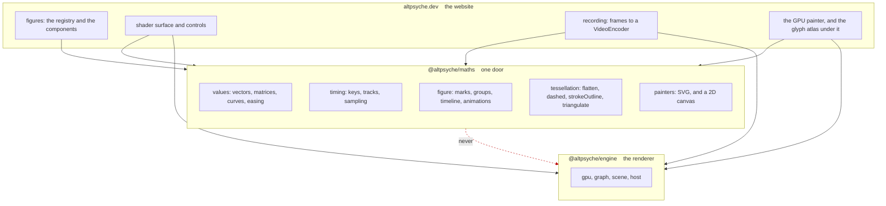
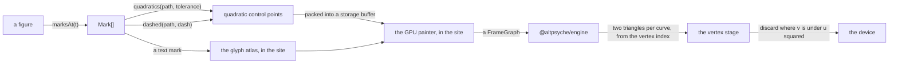

# Roadmap

**This file is the only queue.** If a piece of work is not written below, nobody is tracking it.
[DESIGN.md](../DESIGN.md) is the design and queues nothing.

## The goal, stated by Siva

**Anyone who installs this package should be able to make mathematical animations of the quality
3Blue1Brown publishes.** Manim is the reference, and the two ideas already taken from it are that a
picture is a timeline of animations over named objects and that those objects are measured in the
picture's own units. The goal now is the rest of the vocabulary.

**What that does not mean.** Manim is roughly a decade of work and tens of thousands of lines. The
quality of those videos is also substantially the writing and the pacing, which no library supplies.
What is queued here is the part a library can be held to: whether a picture that channel would draw
can be expressed at all.

**What decides the order.** A package is real when it has a consumer that ships, which is the
argument [DESIGN.md](../DESIGN.md) makes about timing moving in here before a single figure existed. So
an item earns its place by a picture something is waiting to draw, and the two demos below are what
is waiting until the website has a chapter that is.

**The website waits.** Its own roadmap has one open item and nothing there needs anything from this
page, so this package is worked to 1.0.0 first and the site is picked up after.

## The two decisions are answered

Both were Siva's and both are made. They are recorded here because they shape every item below, and
DESIGN.md is corrected to match.

**The typesetter goes behind the one door.** MathJax becomes a runtime dependency of this package
rather than sitting behind a second entry point. The reason is that nobody installs a figures package
without needing to label a picture with mathematics, so a consumer paying for MathJax and never
typesetting is a consumer who does not exist. It runs at build time, so what a reader downloads does
not change. **What would change this answer** is a consumer who draws figures and typesets nothing,
which would make a second door worth its test.

**A figure stops being flat.** Surfaces and vectors in space are a large share of the pictures this
package is meant to be able to draw, so refusing them refuses the goal. The camera is a figure's own
and never the engine's, which is the rule DESIGN.md keeps. **Which version it lands in was left to
the session and the answer was 0.9.0**, last of the feature versions, because everything before it is
reusable in three dimensions and nothing in three dimensions is reusable in two. It is now 0.10.0,
moved down one when the boolean operations took a version of their own, and the reason for its place
is unchanged. **What would change that** is a chapter needing a surface sooner.

**A third decision is answered, and it is the one that shapes everything left.** Siva's, made on
2026-09-08.

**This package takes `@altpsyche/engine` as a dependency and grows a GPU painter and a recorder, so
that one install is the whole of it.** The goal at the top of this file says anyone who installs this
package should be able to make the animations, and a figures package leaving a consumer to wire up a
renderer and write shaders does not meet it. `DESIGN.md` said the opposite until now, and the two
could not both stand.

**What it costs a consumer who never draws on a GPU: nothing.** The painter loads the engine with
`await import()`, which is how the typesetting call already loads MathJax, and the engine's own
backends sit behind dynamic imports of their own.

**What it costs this package.** A fix needed from the engine ships there first. And a claim about
what a device draws needs a device, so the painter carries a browser gate and a card gate that are
not part of `npm test`. Geometry and timing stay held by `npm test` alone.

**The engine must never import this package**, since one direction is a dependency and both are a
cycle. The case that looked like it needed the second, a shader declaring a camera, is answered by
passing the camera as data.

**The website becomes a plain consumer.** It asks for a picture rather than assembling one, and the
GPU painter and the recording move here from there.

**A fourth decision is open, it is Siva's, and 1.3.0 is incoherent until it is answered.**

**May a figure be undrawable in SVG?** `figure/mark.ts` says no, in its own header: what a mark may
ask for is the intersection of what an SVG element and a two-dimensional canvas can both do, rather
than the union, because a figure reaching for something only one painter has "would look right on the
page and lose it without a word in a recording". A third painter makes that a three-way intersection.

**The two answers and what each costs.** If the rule stands, the GPU painter draws the same marks
faster and sharper and gains no capability, so there is no depth buffer and 1.3.0 leaves the ladder.
If the rule goes, a figure using depth is silently wrong in SVG, and the still frame a page puts in
its exported HTML for a reader with no JavaScript is SVG.

**A third answer exists and it is the one worth examining.** A figure declares which painters can
draw it, so a figure asking for depth is refused by the SVG painter rather than drawn wrongly by it.
That keeps the rule's purpose, which is that nothing is lost without a word, while letting the GPU
painter be worth building.

**Nothing in the ladder below 1.3.0 waits on this.** Quadratics, dashes and the painter itself all
draw the marks that exist today.

## The version ladder

**Every item gets its own minor version, then 1.0.0 is the polish.** Siva's plan, and the release
convention this repository already follows makes each one a minor bump. A version is cut when its
demos draw, not when its code compiles. A version that is cut leaves this table and its item goes
with it, because `git log` is what keeps a closed plan.

| version | what lands |
| --- | --- |
| 1.1.0 | Quadratics and dashes, which is what a shader needs from a path |
| 1.2.0 | The GPU painter: the fill, the stroke, and the engine behind a dynamic import, waiting on that package's item 2 |
| 1.3.0 | A figure in space keeps its depth, and the painter writes a depth buffer, if the fourth decision allows it |
| 1.4.0 | Text on a GPU, and a recorder that hands back a file |

**Every version below 1.0.0 is cut and its item is deleted.** What queues work now is the table
above, the found list below, and whatever the consumer asks for.

## The two demos, which are what a version is cut against

**One demo in two dimensions and one in three, and every feature reaches both.** Siva's ask, and it
is also the test DESIGN.md sets for whether a feature is real: a package is real when it has a
consumer that ships, and until the website has a chapter waiting on axes these two are that consumer.

They are written before the feature they need, as the target the work is built to compile. That is
the order rather than a preference: a demo written afterwards checks that the code runs, where a demo
written first says what the code has to be able to say.

**The flat demo is a tangent sliding along a curve**, and it draws as of 0.4.0. It is
`demos/tangent.ts`: the grid, both axes with ticks and labels, the plotted parabola, the region
shaded under it, a point walking along it, the tangent at that point, and the slope written as a
number that changes. As of 0.5.0 the picture arrives rather than appearing, and the walk is measured
along the curve's own length so the dot keeps one speed. As of 0.6.0 the number sits under the
typeset rule it is a value of, and as of 0.7.0 that rule reads `\frac{dy}{dx} = 0` at the stationary
point and walks into `\frac{dy}{dx} = 2x` as the dot leaves it. As of 0.8.0 the walk ends with a
brace measuring how far the curve climbed and a number counting up to that rise.

**How the walk is driven was Siva's call and the answer is the track.** The track drives a fraction of
the curve's length and the scene recovers the graph x from the point it lands on, so the dot, the
tangent and the reading are one number. Driving the dot with a `moveAlong` span while the tangent
stayed on an x track would have been two clocks free to disagree, since a span's eased fraction and a
track's value are unrelated. **What would change this answer** is an animation that can hand the
scene back what it did, which the seam refuses on purpose.

As of 0.10.0 the view follows the dot across, holding it within 1.2 figure units of the middle of the
frame where it used to cross 2.76. As of 0.11.0 the parabola sits on the field of its own tangents,
and the run integrated through that field from the origin never leaves the drawn curve by more than
4.689e-10 of a figure unit.

**The solid demo draws as of 0.10.0**, since nothing before it could draw one. It is `demos/surface.ts`:
a saddle with a level plane cutting through it, the two branches of the curve where they meet drawn on
both, three axes, the equation of the surface typeset beside it, and an eye that goes round once on a
track. What it takes from the versions before it is everything reusable in three dimensions: the axes
read the same tick list, the plane arrives with `fadeIn` and the curve is drawn on with `draw`. As of
0.11.0 three runs of steepest descent are drawn on the saddle, with the field they follow shown as
arrows across the plane.

**A third demo arrived at 0.9.0 and it is the boolean operations' own.** Siva's ask was one demo flat
and one solid, and this is the exception rather than a change to it: a union of two paths has no
picture in a graph of a function and none in a surface either, the way a rotation has none in a flat
graph. So the operation was given a picture whose whole purpose is the operation.

**The same exception was used a second time at 0.9.5, and for the rotation it names.** `demos/rotate.ts`
turns one L a whole circle in two panels, about the middle of the box round it and about a point the
figure names, which is the only way `rotate` reaches a picture at all. It is also the first figure here
to declare itself a loop, so `loops` has a picture behind it too.

**It is `demos/boolean.ts`: two discs drawn three times side by side, as their union, their overlap,
and the first with the second taken out of it.** One disc stands still and the other walks across it,
from clear of it, through touching it at one point, through overlapping it, to sitting wholly inside
it, and out the far side. That walk is what makes the demo a gate rather than an illustration: it
takes the operation through no crossing, one crossing, two crossings and containment, which are the
four cases this kind of code gets silently wrong.

**A version is not cut until its demos draw.** The measurement is the demo's own marks: a count at
named times, compared by tolerance, which is the gate DESIGN.md describes and which needs no browser.

**Every demo is committed and every one is in the README**, which the flat one is as of 0.4.0 and the
boolean one as of 0.9.0 and the rotation one as of 0.9.5. Each image is SVG written by `svgMarkup`,
which needs no browser, so `npm run demos` regenerates the eight of them and a gate compares the
regenerated bytes against the committed files. A picture in a README that nothing regenerates goes stale in silence. **A moving image in a README needs a GIF and this package has no
encoder**, so what the README carries beside the still is a strip of frames in one SVG, which shows
the motion in a still.

## Now

**0.12.0 is cut, and a figure walks out of this package as frames.** `frameTimes` and `framesOf` are
the two calls it added. A frame is its index, its time, its marks and the view they are painted
through, read together at one moment, which is what stops a consumer painting a figure whose view
moves through the matrix of some other moment. Frames come back one at a time, since ten seconds at
sixty frames a second is six hundred frames of every mark a figure draws. The step is a rate or a
count, and a walk stops strictly before the duration, so a loop never hands back its own first frame
twice. The rotation strip is a walk now and draws the same bytes it drew when its four times were
written out by hand. Every frame of both demos is painted through both painters in the suite, which
went from 575 tests to 590.

**0.11.0 is cut, and this package draws fields.** `vectorField`, `streamlineOf`, `arrow3`,
`fieldArrows3` and `vectorField3` are the five calls it added. A field is a function from a place to a
vector and nothing here stores one: what the package holds is the sampling, the drawing and the
integration. An arrow's length is the author's, taken from the magnitude at its own sample, and it is
in figure units on a graph and in the world's own units in space. The streamline's step is a distance
rather than a time, which keeps the points evenly spaced, and halving it divides the error along the
curve by 15.1 and then 15.6. Both demos draw against it: the flat one carries the slope field its own
curve is a streamline of, and the solid one three runs of steepest descent down its saddle. The suite
went from 540 tests to 574.

**0.10.0 is cut, and this package draws in space.** `mat4` is below the line, and `camera3`,
`polyline3`, `dot3`, `text3`, `space`, `surface3`, `surfaceCells`, `axes3`, `sectionOf` and `viewAt`
are above it. A camera is a value the caller holds, a builder that works in space hands back the flat
nodes the rest of the package already draws, and nothing in the marks, the tree, the flattening or
either painter was touched to make that work. `demos/surface.ts` is the solid demo Siva asked for: a
saddle, a plane cutting through it, the curve of the crossing, three axes, a typeset equation and an
orbiting eye. An extent carries a centre and may be a function of the clock, and the flat demo's view
follows its dot across. The suite went from 479 tests to 540 and the sheet list from six pictures to
eight.

**The lock file agrees with the manifest again**, and holding it there is one
`npm install --package-lock-only` in whichever commit bumps a version.

**1.0.0 is cut, and the door is a promise.** Seventeen steps closed it: the comments holding a
measurement became assertions, the door was read name by name against three questions and ten names
were renamed and two removed, the option bags took one shape, the demos took one palette, the strips
took one shape, the sheets were chosen to be looked at, and the four prose surfaces were written in
one register. The door is 230 names, the suite is 637 tests over 40 files, and the prose is a 175
line README, a 544 line guide, a 805 line reference and a 387 line DESIGN.md. Every done-criterion
was verified line by line in the commit that cut it.

**What 1.0.0 promises is `index.ts`.** A name at the door does not change under a consumer without a
major version, which is the whole of what the number means here. Everything below the door stays
free to move.

**0.14.0 is cut, and a sheet paints the ground it was measured against.** `SvgColour` is the door's
name for a colour per ground, and `SvgMarkupOptions.ground` is what a sheet paints behind its own
marks. Inside an `` the colour scheme query answers for the browser rather than for the page
around it, so npm's white page was shown the dark half: the six reading colours fell from 15.87:1
through 6.75:1 to 1.19:1 through 2.80:1, and the typeset equation at 1.19:1 was the one a reader
could not see. A ground is written as a `background` declaration on `:root` in each half of the style
element rather than as a mark, so the bare-fraction readings of 0.13.0 are untouched. All eight
sheets grew by 38 bytes. The door went from 229 names to 230 and the suite from 631 tests to 637.

**0.14.0 is held back rather than published, which is Siva's call.** It ships inside the 1.0.0
release instead, so npm carries the unreadable sheets until then. What would change the answer is
1.0.0 slipping far enough that a reader lands on those sheets for weeks rather than days.

**0.13.0 is cut, and the eight sheets read on a dark page and are worth looking at.** Every colour is
painted as `var(--name, light)` and `svgMarkup` writes the theme as a `<style>` element, so a sheet
follows the reader's colour scheme through an `` with no page CSS reaching it. A value per
ground is forced rather than chosen: to clear 4.5:1 the luminance a colour needs is 0.183333 or less
on white and 0.199675 or more on `#0d1117`, a gap no single value fits. The six reading colours read
17.22:1 through 4.83:1 on white and 15.87:1 through 6.75:1 on the dark ground, and the twelve washes
stay between 1.2:1 and 4.5:1 on both. The door went from 227 names to 229.

**A still is written into a frame its own extent shapes**, at a hundred pixels to the figure unit.
Coverage read on the box round the marks is a number an empty frame passes, since a word in each far
corner stretches the box over the whole frame, and the share of cells no mark's ink reaches replaces
it. The eight sheets went from 21.2%, 17.1%, 67.4%, 56.5%, 81.8%, 76.3%, 59.5% and 50.4% bare to
21.2%, 17.1%, 60.1%, 56.5%, 71.5%, 72.3%, 46.1% and 43.2%. The suite went from 618 tests to 631 and
the four stills draw text at 17.33, 20.0, 20.8 and 19.32 pixels on the page.

**Both of the criteria that needed a call are answered and Siva made both.** The still the README
opens on draws the largest smallest glyph now: `tangent.svg` went from 17.33 pixels to 21.33 against
20.0, 20.8 and 19.32, holding 21.2% bare, so it leads both readings and the gate asserts the lead.
The strip criterion names the slot rather than the fill, since a frame holding two panels needs a gap
between frames wider than the gap inside one.

**1.0.0 is being worked and sixteen of its seventeen steps are ticked.** The door is 230 names, the
suite is 637 tests over 40 files, and the four prose surfaces are a 175 line README, a 544 line
guide, a 805 line reference and a 387 line DESIGN.md. **The next session starts at step 17**, which
is one commit once Siva has read the README and the guide.

**Every done-criterion below is verified but one, and that one is Siva's.** The three gates pass, the
lock file agrees with the manifest, `npm run demos` leaves all eight sheets byte for byte as
committed, the reference has 230 entries against 230 names with a gate holding them equal, the
README and the guide read at a sentence mean of 16.6 and 15.1 words with none over 30, the guide's
seventeen code blocks compile in order, no comment in the tree carries a measurement nothing asserts,
no inline comment run is longer than two lines, and DESIGN.md carries none of the banned phrases. What
is left is **Siva reading the README, the guide and the pictures once and saying so**. On his word,
step 17 is one commit: the version to 1.0.0, `npm install --package-lock-only` in the same commit,
and `npm publish` asked for rather than assumed.

**The four prose surfaces were rewritten in one register, which is Siva's call and not a step.** He
read the pages, rejected the tone twice, and named the model: Eric Lengyel. Definitions first, third
person, the standard name for anything that has one, and every number with the expression behind it.
CLAUDE.md's voice brief carries the rule. All four read at a sentence mean between 15.1 and 16.6 with
none over 30, no banned phrases and no second person. The guide's seventeen code blocks still compile
in order and the reference gate still holds 227 entries against 227 names.

**Step 17's last criterion is Siva reading those four pages once and saying so**, and the pages
changed under it after this rewrite, so that read is of the current text rather than of what was
there before.

**Four findings landed on the way through steps 14 and 15**, each in its own commit. `indicate` walks
into a colour and two comments still said it swaps. Gradients are refused for a reason three files
stated wrongly, since both painters draw one. The demos' comments were never held to the rules the
library's are, and five measurements in them are assertions now. The guide's examples used six names
it never defined.

**What the 0.9.x audit found sound**, so that a later session does not go looking again. Sixty random
pairs of shapes with no coincident edges hold both `area(A) + area(B) = area(A or B) + area(A and B)`
and `difference = A less the overlap` to 1.776e-15. Two circles crossed at every scale from 1e-4 to
1e4 answer 4.11e-4 of the closed form, the same share at every one, so nothing there turns on the
tolerance being an absolute distance. Two 400-piece paths unite in 48ms, so the crossing search needs
no box test in front of it and the quadratic over piece pairs is not worth removing.

## The items

Each is a version above. What follows is what each one covers.

### Quadratics and dashes, 1.1.0

A tessellation is a shape rewritten as the pieces a renderer draws: a curve as a run of straight
segments, a stroke as a fillable outline, and a fill as triangles. Every part of it is numbers in and
numbers out, so it is held by the suite the way the boolean operations are and needs no browser.

**What it is and what it is not.** This version is the part of a GPU painter that is pure geometry
and needs no device: a cubic rewritten as the quadratics a shader can test exactly, and a dash
resolved into the runs that are drawn. The painter itself is 1.2.0. Splitting them this way is not a
boundary between packages any more, since the decision above brings the painter here too. It is a
boundary between what `npm test` holds and what a card holds, and landing the tested half first means
the painter is written against calls that already have their numbers.

**What it is worth on its own merits.** `strokeOutline` turns a stroke into a path, so the boolean
operations reach strokes, which they cannot today. `quadratics` is what a hit test against a curve
needs and what `length.ts` already samples for by hand. Neither waits on a device.

**What argues against it.** The demos draw 144, 12 and 244 marks, and SVG draws those instantly and
sharper than triangles would. Nothing is waiting to draw this, which is the test this file orders its
items by, so **whether 1.1.0 is worked at all is Siva's call rather than a session's.**

**The depth buffer is not reached through this seam, and drawing the graph is what showed it.** A
mark is flat. `PathMark` holds a `Path` of `Vec2` and carries no z, and `scene3` sorts its items by
the mean depth of their own points and then hands back a flat group, so the depth it measured is
gone before a painter sees anything. A GPU painter fed `Mark[]` therefore gets geometry already
ordered by the painter's algorithm and has nothing to write into a depth buffer. **The argument that
a depth buffer removes the cyclic-overlap case is true and this seam does not deliver it.**

What the door does carry is `camera3.project`, which returns a `Projected` with a depth, and
`SpaceItem`, which is a piece's world points beside the flat node built from them. So depth per piece
is reachable today and depth per vertex is not. **Closing that is a separate item and it is Siva's
call**, since the three answers are a mark carrying an optional z, a second call handing back space
geometry unflattened, or the GPU painter projecting `SpaceItem` points itself. The first widens a
door frozen at 1.0.0 and breaks the rule in `figure/mark.ts` that a mark asks only for what an SVG
element and a 2D canvas can both do.

**1.1.0 as written is still worth its own steps**, because flattening, dashes, stroke outlines and
triangulation are what a GPU painter needs for a flat figure whatever the answer to depth is, and
`strokeOutline` earns its place with no painter at all.

#### The graph, with this item in it

Nothing new crosses a boundary. This package still imports no renderer, and the site still holds both.

**How a figure reaches a card, with nothing about a device crossing into this package.** Each arrow
carries plain values, and the last one is the only one that touches a driver.

**No triangle crosses the boundary, and reading Manim is what showed that.** A vertex stage there
generates six vertices per curve from the vertex index alone and reads the three control points out
of a buffer, so the only thing a processor has to send is the control points. What this package
contributes to a GPU painter is therefore smaller than the first plan assumed: a cubic rewritten as
quadratics, and a dash resolved into runs. The triangles, the winding count and the anti-aliasing are
all the shader's.

**What answers the question of how this package reaches a renderer: it does not, and it does not need
to.** Control points are numbers. The site imports both packages and joins them, and the arrow drawn
in red above stays undrawn. That is the arrangement `DESIGN.md` already fixed, and nothing found this
session moves it.

**The thing that costs quality is not the split.** It is `figure/space.ts` projecting a point and
keeping only where it landed. Manim sends `vec3f` control points to its vertex stage and projects
there, which is what makes a depth buffer work; this package projects on the processor and hands a
painter two-dimensional marks. Sending `vec3` control points across this boundary needs no renderer
import either, since a coordinate is a number the same as any other. **So the depth question and the
dependency question are separate, and answering the first does not touch the second.**

**Its steps are written below, and no code was touched in the session that wrote them.**

**The step list below was rewritten after reading how Manim does this**, which is recorded under the
entry as what the techniques are named. The first list flattened every cubic on the processor and ear
clipped the fill into triangles. Both are the wrong technique and the reading says why.

- [ ] **1. A cubic as quadratics.** `quadratics(path, tolerance)` rewrites each cubic as a run of
  quadratic Bézier pieces within a tolerance. A quadratic is what a fragment shader can test exactly:
  the canonical control points (0,0), (0.5,0) and (1,1) put the curve on `v = u²`, so a pixel is
  outside when `v < u²` and one comparison decides it. A cubic has no such test, which is why Manim
  converts and why this is the first step rather than an optimisation. **Measures:** the greatest
  distance from the quadratic run to the true cubic at tolerances of 1e-2, 1e-3 and 1e-4; the piece
  count at each; and a quarter arc converted and read back inside the 2.6 to 2.8 parts in ten
  thousand the control distance already leaves.

- [ ] **2. A fill as two triangles for each curve.** `fillTriangles(path)` returns, per quadratic, the
  fan triangle reaching back to its subpath's first point and the triangle on the curve's own three
  control points, with the `uv` coordinates that put the curve on `v = u²`. Nothing here decides what
  is inside: the winding number is counted per pixel from which way each triangle faces, which is a
  stencil pass the site owns. **This replaces the ear clipping the first list planned**, which
  triangulates a flattened outline and therefore fixes the resolution at authoring time and costs
  more the more complex the shape. Two triangles per curve is the whole cost whatever the shape.
  **Measures:** the triangle count against twice the curve count exactly; the covered area against
  `area(path)`, which is closed form by Green's theorem; and a ring under both fill rules coming out
  right from the facing alone.

- [ ] **3. A dashed path as the runs that are drawn.** `dashed(path, dash, offset)` returns the drawn
  runs as subpaths of their own, reading `length.ts` for where a length falls inside a piece. Both
  painters resolve a dash themselves and a shader has nothing that will. **Measures:** the summed
  length of the returned subpaths against the drawn share the dash array asks for, on a straight line
  and on a circle; and a dash longer than the path returning the whole path once.

- [ ] **4. A stroke as a path that can be filled.** `strokeOutline(path, stroke)` returns the region a
  stroke covers, with miter, round and bevel joins and butt, round and square caps, and a miter limit
  past which a miter becomes a bevel. **This is no longer what a GPU painter uses.** Manim expands a
  stroke into a strip of quads inside the shader, breaking each curve into segments per frame so the
  count follows the view, and a stroke expanded on the processor cannot do that. The step stays
  because it is what lets the boolean operations reach strokes, which is its own reason.
  **Measures:** the outline's `area` against width times length exactly for a straight segment; the
  same for a closed square; the miter limit taking effect at the angle it names; and a round join's
  edge inside the same 2.6 to 2.8 parts in ten thousand as every other arc here.

- [ ] **5. The demo the layer is cut against.** A sheet whose whole purpose is the tessellation, which
  is the exception `demos/boolean.ts` and `demos/rotate.ts` already set. One shape is drawn three
  times side by side: as its cubics, as the quadratic run step 1 returns, and as the two-triangle
  cover step 2 returns, with the piece and triangle counts written under each. A tolerance walks from
  coarse to fine across the clip, so the counts move and the quadratics tighten onto the curve.
  **Measures:** the sheet's marks at four named times; its bare fraction under the four fifths every
  sheet is held to; its smallest glyph above the fourteen pixel floor; and the counts written on it
  asserted against what the calls return.

- [ ] **6. Cut 1.1.0.** The version bumped in this commit, `npm install --package-lock-only` in the
  same one, the reference given an entry per new name, the guide given a section, and the
  done-criteria verified line by line. **Measures:** the three gates; all nine sheets identical after
  `npm run demos`; the door and the suite from 230 names and 637 tests.

#### Done-criteria

- A cubic rewritten as quadratics at a named tolerance stays within that tolerance of the true cubic,
  and the suite says so at three tolerances.
- A fill returns exactly two triangles per quadratic, and the area they cover is `area(path)` to a
  named tolerance under both fill rules.
- A dash array resolves to subpaths whose summed length is the drawn share, on a straight path and on
  a curved one.
- A stroke outline's area is the closed form for a straight segment and for a closed square, and the
  three joins and three caps each have a test.
- The demo draws, its marks are asserted at four named times, and the counts written on it are the
  counts the calls return.
- Nothing in this item imports a browser API, and the whole of it is held by `npm test` alone.
- The reference has one entry per name at the door and the gate holds them equal.
- `npm test`, `npm run type-check` and `npm run build` pass, and the lock file agrees with the manifest.

#### How Manim does this, read from its own source on 2026-09-08

**Quadratics, never cubics.** `manimlib/mobject/types/vectorized_mobject.py` stores anchors at
`points[0::2]` and handles at `points[1::2]`, and `add_cubic_bezier_curve_to` converts through
`get_quadratic_approximation_of_cubic`. The reason is the fragment test above.

**A fill is two triangles per curve and a stencil buffer.** `manimlib/shaders/fill.wgsl` says it: "Each
bezier of a path contributes two triangles: one reaching back to the mobject's base point, which
together with those of the other beziers covers the interior of the path, and one hugging the curve
itself, whose fragments falling outside it are cut away." And on what decides the interior: "Nothing
here decides what is inside the path. The winding number around each pixel does, counted in the
stencil buffer from which way each of these triangles happens to face once projected." The fragment
stage is one line, `if (in.fill_all == 0.0 && in.uv_coords.y < in.uv_coords.x * in.uv_coords.x) {
discard; }`. The technique is Loop and Blinn's, from "Resolution Independent Curve Rendering using
Programmable Graphics Hardware".

**A stroke is a quad strip built in the shader.** `manimlib/shaders/stroke.wgsl` draws "a strip of
quads following each bezier, with a fan of triangles rounding off the joint at each end", breaking
each curve into segments with a `POLYLINE_FACTOR` of 100 and a `MAX_STEPS` of 32. The count follows
the view because it is computed per frame.

**A point stays in space until the vertex stage.** Both shaders read `vec3f` control points and call
`project_point(point)` in the vertex stage. Manim never flattens to two dimensions before the
renderer, which is exactly what `figure/space.ts` does here, and it is why a depth buffer is within
Manim's reach and outside this seam's. Depth testing is per object and off by default:
`apply_depth_test` turns it on.

**Manim's shaders are WGSL.** The `manimlib/shaders` directory is `fill.wgsl`, `stroke.wgsl`,
`surface.wgsl` and the rest, so the move Siva proposed is the move that project already made.

**The site's half of this is queued in that repository**, as the GPU figure painter, and it names this
item as what it waits on.

## Found while working, not yet queued

- **The ladder freezes an API before anything validates it.** 1.1.0's demo draws quadratics as SVG,
  which checks the arithmetic and not whether the output is the shape a shader wants, and the painter
  that would say is 1.2.0. The engine's stencil gap below was found by reading its source rather than
  by building anything, and a throwaway spike of the painter would have found it in an hour. **A
  spike before 1.1.0 freezes a name is worth its own session** and touches nothing that ships.

- **The engine cannot count a winding number, and 1.2.0's fill needs one.** `StencilMode` there is a
  boolean mask: `mark` replaces every bit where it draws, `inside` keeps what compares equal, and
  both set the front and back faces to one state. A winding number is counted by front and back faces
  cancelling, which is the whole of how Loop and Blinn's fill decides an interior. **It is filed in
  that repository as its item 2**, argued on its own merits, and 1.2.0 waits on it.

- **A 1.0.0 package depends on a 0.3.0 one.** This package has promised its door does not change
  under a consumer, and `@altpsyche/engine` is below 1.0.0, where a minor may break anything. The
  promise cannot be honoured through a dependency that does not make it. Either the version is pinned
  exactly and the churn is taken by hand, or that package reaches 1.0.0 first. **Siva's call**, and it
  is wanted before 1.2.0 ships rather than after.

- **This repository has no continuous integration at all.** There is no `.github/workflows`, and the
  three gates are run by hand. The decision above says the GPU painter carries a browser gate and a
  card gate, and `@altpsyche/engine` needed two workflows and seventeen gate scripts to have those.
  Building that here is unestimated and is plausibly the size of the painter.

- **A card gate is a gate only one machine can run.** The engine's card gate is measured on an RTX
  5080, which is right for a renderer used in one place and is a maintenance problem for a package
  published to npm: a correctness claim nobody else can check goes stale without anyone learning
  that it has. What a published package can hold is the browser gate; what the card gate can hold is
  a reading that is dated rather than a gate.

- **The renderer may be the wrong thing to build for the goal.** Manim's value is a decade of
  builders, number lines through matrices and tables and arbitrary shape morphing, and this file
  already says that its videos are substantially the writing and the pacing. Four versions of
  renderer work buy pictures that are sharper and can hold a depth buffer. The same effort spent on
  builders over the SVG painter that exists moves closer to a reader being able to make the video.
  **Siva's call, and it is the one that decides whether the ladder above is the right ladder.**

- **A run of descent shows a short hook where it meets the region's edge.** The run seeded at
  `(-1.3, 0.3)` draws a bracket a few points long at its start on both solid sheets, which reads as a
  kink rather than as the run leaving the region. Found while cutting 0.13.0's step 10.

- **The word riding the shape crosses it in two of the eight rotation frames.** `upright` sits at a
  fixed offset from the shape's centre and the shape turns under it, so at two of the eight times in
  `rotate-strip.svg` the word overlaps the drawn edge. The offset is one vector in `demos/rotate.ts`
  and what it wants is a place the turn cannot reach. Found while cutting 0.13.0's step 3.

## Someday

- **Gradients along a stroke or across a fill.** The refusal stands and the reason was corrected at
  1.0.0: both painters draw a gradient, so the intersection rule was never what refused it. What
  refuses it is that a colour is text and a gradient is not, so it wants a shape of value the marks do
  not have, an id unique across every figure on a page, and a rule for how it is measured. Nothing has
  asked for one.
- **A variable-width stroke.** What Manim gets from its own renderer and neither painter here offers.
